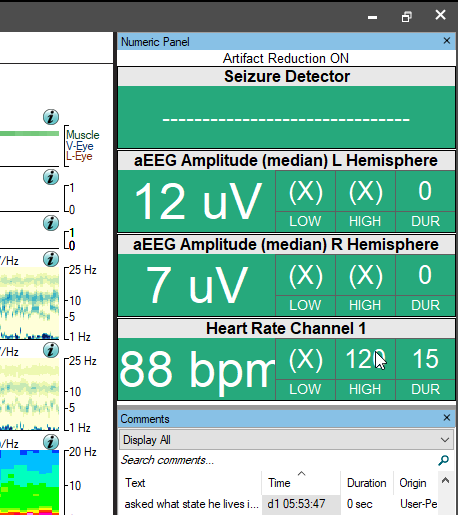
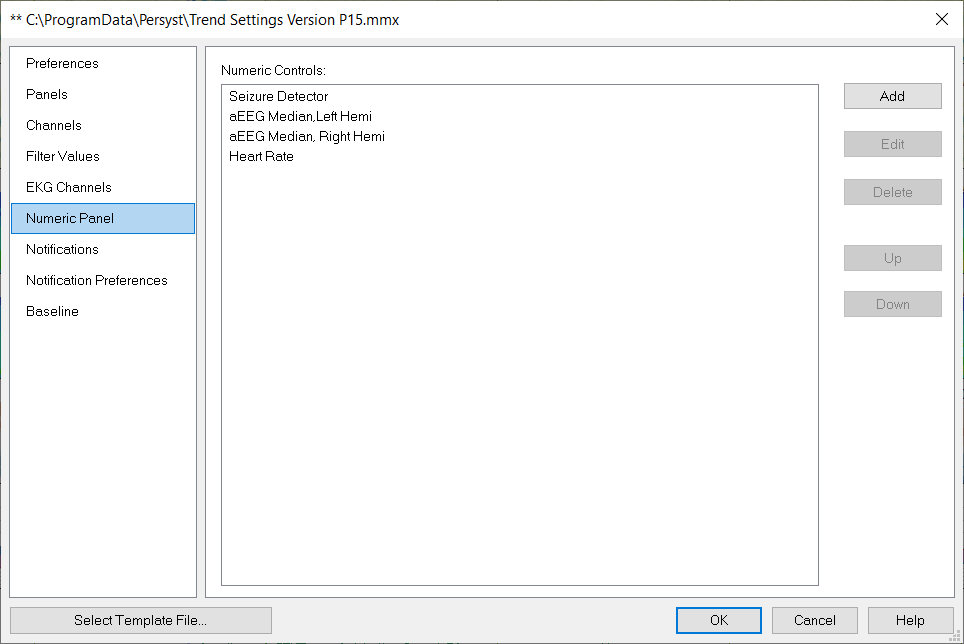
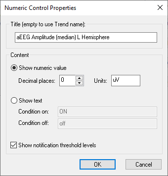

# Trend Preferences: Numeric Panel

# **Trend Preferences: Numeric Panel**

Use the **Numeric Panel**
tab to add Numeric Displays for trends listed on the Notifications tab to the Numeric Panel that can be displayed in the upper-right corner of the Persyst display.      

Select **Preferences|Trend Preferences**
. Select the **Numeric Panel**
tab.

**Add:** Add a trend listed on the Notifications tab to the Numeric Panel. Note that trends must first be added to the Notifications tab before adding them as a Numeric Display.

**Delete:** Remove a trend listed on the Notifications tab to the Numeric Panel.

**Edit:** Edit the display properties for the values in the Numeric Display.

**Move Up/Down:** Change the order of Numeric Displays within the Numeric Panel.

**Numeric Control Properties:** Edit the display properties for the values on the Numeric Display.

**Title:** Change the title of the Numeric Display shown in the Numeric Panel.

**Show Numeric Value:** Show the numeric value of the trend at the cursor position, Decimal places, and Units in the Numeric Panel.

**Show text (Condition on/Condition off):** Instead of values, show text based on the value being Condition on (e.g., outside the Lower and/or Upper limit) or Condition off (e.g., within the Lower and/or Upper limit) in the Numeric Display shown in the Numeric Panel.

**Show notification threshold levels:** Show thresholds for Lower Limit, Upper Limit, and Duration on the Numeric Display shown in the Numeric Panel.

