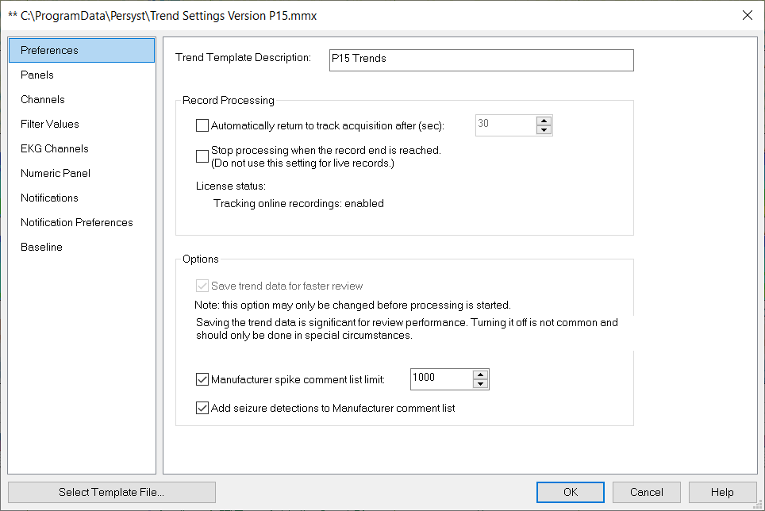

# Trend Preferences: Preferences

# **Trend Preferences:** **Preferences**

**Trend Template Description:**
Use this field to enter a descriptive label for the trend definitions file (optional).

**AutoEnd (offline only):**
Automatically stop processing trend/detection results when the end of the EEG recording is detected. Note that this option should not be used when processing on-line EEG recordings (e.g., EEG recordings currently in progress).

**Automatically revert to Track Acquisition after (sec****):**
The trends and EEG waveforms can be paged through during acquisition within
Persyst 14
. This selection sets the number of seconds of mouse/keyboard inactivity before the trends and/or EEG waveforms displayed in
Persyst 14
revert to tracking the live EEG acquisition.

**Save trend data for faster review (default):**
If this is selected, the trend data for each trend is saved in an individual file and only the displayed trends are loaded during review for faster trend paging during review over a LAN connection. If this option is not selected, then all of the trend data for each trend is saved within a single file (not recommended).

**EEG system spike annotation limit****:**
If this is selected then the number of spikes written to the EEG system annotation list will be limited to the value entered. The number of spikes displayed in the Persyst Comment List, Trends, and Spike Review is not affected.

**Add seizure detections to EEG system annotations****:**
If this is selected then seizure detection comments are written to OEM EEG system annotations that support this. Seizure detection annotations in the
Persyst 14
comment list are not affected.