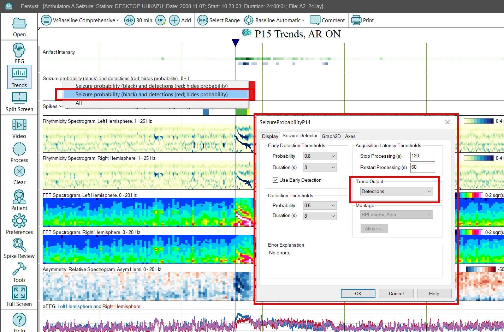

# Trend Types: Seizure Detection

# **Trend Types: Seizure Detection**

The Persyst Seizure Detector runs as a part of Persyst trending.

Persyst 15 Trending includes both seizure detection and seizure probability trends. These are closely related and represent stages in the output of the Persyst seizure detector algorithm.  The seizure detector algorithm works by taking numerous inputs and combining them into a probability value from 0 to 1. The seizure probability represents the probability that the epoch represents an electrographic seizure. Thus, for example, if an epoch were given a value of 0.2 we would expect that there is a 20 percent chance that this epoch represents an electrographic seizure. A value of 0.2 means that 200 out of 1000 1-second epochs marked with a value of 0.2 are expected to be seizure events. For an epoch with a value of 0.8, 800 out of 1000 epochs with a value of 0.8 are expected to be seizure events.

The Seizure Probability trend provides a display of the calculated seizure probability. This contrasts with the Seizure Detection trend that provides a discrete value of zero or one depending on whether a seizure has been detected. When the seizure probability value is greater than or equal to  0.5 for 8 consecutive seconds the seizure detector marks this range of epochs as a seizure. The seizure is marked form the first epoch of the 8-second period. The seizure is considered to end when the seizure probability subsequently drops below0.5. Thus the Seizure Probability trend provides more detail about the results of the Persyst seizure detection algorithm than the Seizure Detection trend. This detailed seizure probability information may be relevant to users who would like to see cases where there is some indication of seizure activity that does not rise to a sufficient level to be considered a seizure detection. It may also be useful to understand the level of certainty in cases where there is a seizure detection. 

(Refer to Appendix A for information on the performance characteristics of Persyst Seizure Detection.)

The Persyst Seizure Detector also annotates the Comment List with the text “@SeizureDetected(Persyst)
”. Seizure Notifications are annotated in the Comment List with the text “@SeizureNotified
(Persyst)”. This format is used so that (a) when sorted alphabetically, the seizure detections are shown at the top of the comment list and (b) so that the Persyst seizure detections are uniquely identifiable from annotations added by a human reader.

Method: Persyst Seizure Detection Algorithm.

User-adjustable parameters:

1. - For EEG signal to be analyzed: none
   - Probability (Detection): Sets the minimum Probability value (maximum sensitivity) for seizure detections that will be displayed in the Comment List and on the Seizure Detection trend. The default value is 0.5.
   - P
     robability
     (Early Detection): Sets the minimum Probability value (minimum sensitivity) for seizure detections that will be displayed in the Comment List and on the Seizure Detection trend. The default value is 0.8.
   - Duration (Detection): Sets the minimum Duration value in seconds for seizure detections that will be displayed in the Comment List and on the Seizure Detection trend. The default value is 8 seconds.
   - Duration (Early Detection): Sets the minimum Duration value in seconds for seizure detections that will be displayed in the Comment List and on the Seizure Detection trend. The default value is 8 seconds.
   - For Seizure Detection graph: x-axis duration (timescale), y-axis range, and color for line graph and optional color fill.
   - Trend Output: Probability (0-1), Detections (probability and duration exceeded), or Notifications (seizure notification generated).
   - Acquisition Latency Thresholds Stop|Restart Processing: When data is interrupted/paused during on-line processing, automatically pause and restart seizure detection (seconds). Default Stop: 120s. Default Restart: 60s.
   - Montage: Not user adjustable.

The channel montage used by the Persyst Seizure Detector is fixed and cannot be changed by the user.

Note that seizure detections have a minimum duration of 8 seconds when default settings are used. Inter-ictal bursts of shorter duration will not be marked as seizures by the Persyst seizure detector. (Refer to Appendix A for information on the performance characteristics of Persyst Seizure Detection.)

The Persyst Seizure Detector is fully automatic. It does not require any training on the patient’s background EEG. The only two requirements are:

**EEG quality:**
EEG must be of readable quality by a trained physician. EEG electrodes that are dislodged or otherwise not recording EEG will provide insufficient waveform data for seizure detection. The Persyst Electrode Status Display will indicate the presence of bad EEG electrodes that must be corrected or re-applied.

**Run the** **Persyst Seizure Detector:**
The Persyst trend display should advance during detection, indicating that the seizure detection processing has not been paused or otherwise disabled.