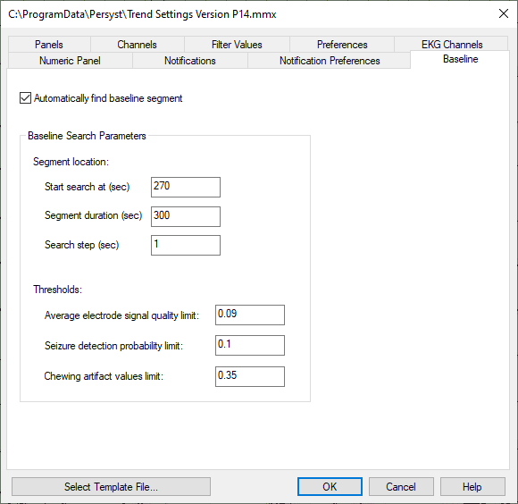
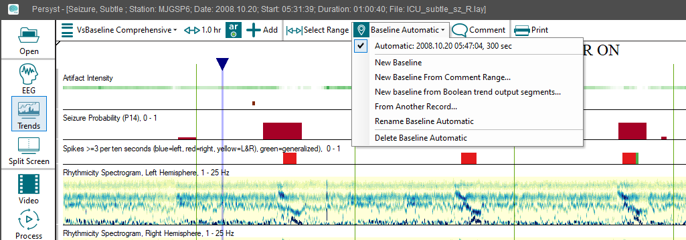

# Trend Types: VsBaselineNValue, VsBaseline, VsBackground

## **Trend** **Types:****VBaselineNValue (VsControlNValue),** **VsBaseline****(****Vs****Control)**

**VsBaseline****(****VsContro****l****NValue/VsControl)**

For trends that generate
multiple values versus time, the VsBaselineNValue (VsControlNValue), or for a
series of single values versus time, the VsBaseline
(VsControl)
trend allows a user to create a new trend that performs a statistical comparison between an original trend’s value at successive epochs in time (the “foreground) and a fixed baseline (“control”) epoch’s value, or to baseline value that is set and manually entered by the user. The durations of the foreground and control epochs used for this statistical assessment are independently user-adjustable by setting the Foreground range and Control range parameters, respectively. Values for the Control range parameters can either be set manually or can be specified by designating a baseline segment of the original trend using cursor controls to specify a Control range for use in the calculations.

  
*Overview of the general setup of Foreground and Control in the VsControl trend*

(Note: The primary difference between the VsBkgnd and VsBaselineNValue (spectrograms)
and
VsBaseline (single values)
trends
is that the
VsBkgnd type
trends use
fixed (Control) values against which the Foreground values are compared, as opposed to the VsBkgnd trend, in which the Background values vary due to the running (moving) nature of the Background epoch.)

Vs.BaselineNValue and VsBaseline
values are set by marking a Baseline range from the Trend Toolbar or automatically based on the parameters selected in the Baseline dialog (**Preferences|Trend Preferences|Baseline**
).

**Baselines****:**
Mark a range in the trend to set a baseline for statistical trends.

**New Baseline****:**
Mark a range in the trend to set a baseline manually.

**New Baseline From Comment Range****:** Mark a range in the trend to set a baseline using an existing duration annotation/comment.

**New baseline from Boolean trend output segments:** Rather than using the Automatic or manually-created baseline, this option creates a baseline based on the output of a boolean trend, e.g., a user-created boolean trend output that is "true" when @Wake duration comments are present, but not during chewing artifact.

**From Another Record****:**
Manually open another recording to use an existing baseline from that record.

The precise definitions of the Foreground range start time, the Control range values, and the available statistical operat
ions, are discussed in detail below.

A VsBaselineNValue (spectrogram) or VsBaseline (line value) trend performs a comparison operation between foreground epochs and control (fixed) background epochs of an existing three-dimensional (VsBaselinelNValue) or two-dimensional trend (VsBaseline), or between foreground epochs and user-specified baseline (fixed) parameters, for an existing trend, and plots the result as a function of time. Available operations include calculation of the ratio of the mean foreground versus mean control values, calculation of the difference between the mean foreground and mean control values, and various other statistical comparisons between foreground and control epochs or parameters.

Method: The user specifies an operation to be performed (see list below) and the duration, in seconds, of the multi-epoch foreground. The user-specified baseline control range used for comparison to the foreground is specified either by assigning a range through manually marking the EEG or trends (via right-click on the EEG or trend pages), or by manually entering the control population’s epoch count, mean (average), and standard deviation. VsBaselineNValue and VsBaseline use Empirical Null only. The following operations are available for VsControlNValue and VsControl.

AvgRatio = 

AvgDelta = 

StdDevRatio = 

StdDevDelta = 

DeltaAvg/StdDev = 

TStat (student
’
s T-test statistic) = 

AvgDeltaOverAvg = 

where xf
is the mean of the foreground range values, xc
is the mean of the control range or parameter values, sf
is the standard deviation of the foreground range values, sc
is the standard deviation of the control range values, Nf
is the number of epochs in the foreground, and Nc
is the number of epochs in the control range or parameter specification. Start time of
the Foreground epoch, Tf
, is defined as follows, where Time is the current epoch start time:

Tf
= Time - DurForeground + EpochStep.

Empirical Null (default)

The Empirical Null option uses uses the selected range of trend data (Baseline) to estimate
an appropriate null distribution from which to calculate Z-Score deviations from the Empirical Null. Calculation: This modification of the student
’
s t-test adjusts for non-random correlations between time steps (epochs) of the EEG. The ZScore output of th
e
t-test is normalized by the average and standard deviation of the t-test computed over the baseline region: ZScoreNormalized = (ZScore-BaselineZScoreAvg)/BaselineZScoreSD.

- User-adjustable parameters:
- - For VsBaselinelNValue/VsBaseline trend calculations: Trend on which the VsBaselineNValue/VsBaseline Trend operation will be performed, Duration of Foreground range, Count of Control range epochs, Average (mean) of control range values, StdDev of Control range values (note: Control range values can be set
    and selected from the Baselines button)
  - For VsBaselineNValue trend graph: x-axis duration (timescale), y-axis frequency range (Hz), z-axis scale (depending on user analysis needs, z-axis (power scale) range, and color palette used for z-axis data
  - For VsBaseline trend graph: x-axis duration (timescale), y-axis range, and color and optional fill color used for line graph
  - Parameter settings utilized in default trend examples (Trend Settings Version P15.mmx) shipped with software: an example VsBaselineNValue trend is included in the example file.

**VsBackground (Moving):**

For trends that generate a series of single values versus time, the Vs
B
ac
kg
rou
nd
(moving)
trend allows a user to create a new trend that performs a running (moving) statistical comparison between an orig
inal trend
’
s value at successive epochs in time (the “foreground) and a relative time-locked trailing (preceding) epoch
’
s value (the “background”). The durations of the foreground and background epochs used for this statistical assessment are independentl
y
user-adjustable by setting the Foreground range and Background range parameters, respectively, and the standing time separation between the Foreground and Background epochs being assessed is adjustable using the Lag parameter (see illustration).

*Overview of the general setup of Foreground, Background, and Lag in the VsBkgnd trend*

(Note: The primary difference between the VsBkgnd and VsControl trends is that the VsControl trend uses fixed (Control) values
that are set by marking a B
aseline range from the Trend Toolbar
against which the Foreground values are compared, as opposed to the VsBkgnd trend, in which the Background values vary due to the running (moving) nature of the Background epoch.)

The precise definitions of relative
start times of the running Foreground and Background epochs, the time separation between them, and the available statistical operations, are discussed in detail below.

A VsBkgnd trend performs a comparison operation between moving foreground epochs and mo
ving background epochs of an existing two-dimensional trend, and plots the result as a function of time. Available operations include calculation of the ratio of the mean foreground versus mean background values, calculation of the difference between the
m
ean foreground and mean background values, and various other statistical comparisons between foreground and background epochs.

Method: The user specifies an operation to be performed (see list below) and the duration, in seconds, of the multi-epoch foreg
round and background ranges to which the chosen operation will apply. Optionally, a lag (in seconds) can be specified to allow further temporal separation of the foreground and background ranges. The following operations are available:

AvgRatio = 

AvgDelta = 

StdDevRatio = 

StdDevDelta = 

DeltaAvgOverStdDev = 

TStat (student
’
s T-test statistic) = 

where xf
is the mean of the foreground range values, xb
is the mean of the backgr
ound range values, sf
is the standard deviation of the foreground range values, sb
is the standard deviation of the background range values, Nf
is the number of epochs in the foreground, and Nb
is the number of epochs in the background. Start time of the F
oreground epoch, Tf
, is defined as follows, where Time is the current epoch start time:

Tf
= Time - DurForeground + EpochStep.

Start time of the Background epoch, Tb
, is defined as follows, where Time is the current epoch start time:

Tb
= Time - DurBackg
round - DurLag - DurForeground + EpochStep.

- User-adjustable parameters:
- - For VsBkgnd trend calculations: Trend on which the VsBkgnd Trend operation will be performed, Duration of Foreground range, Duration of Background range, Lag (seconds), Operator (s
    ee list above)
  - For VsBkgnd trend graph: x-axis duration (timescale), y-axis range, and color and optional fill color used for line graph
    .