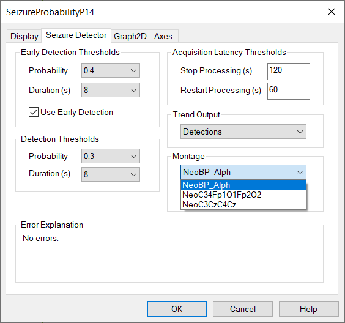

# Neonatal Seizure Detection

# **T****rend Types: Neonatal Seizure Detection**

The Seizure Detection trend uses a line graph to show the output of the Persyst Neonatal Seizure Detector.  Its value is one when a seizure is detected and zero when no seizure is detected. (Refer to Appendix A for information on the performance characteristics of Persyst Neonatal Seizure Detection.)

The Persyst Neonatal Seizure Detector also annotates the Comment List with the text “@SeizureDetected(Persyst)”. Seizure Notifications are annotated in the Comment List with the text “@SeizureNotified  (Persyst)”. This format is used so that (a) when sorted alphabetically, the seizure detections are shown at the top of the comment list and (b) so that the Persyst seizure detections are uniquely identifiable from annotations added by a human reader.

Method: Persyst Neonatal Seizure Detection Algorithm.  
  
User-adjustable parameters:

- - For EEG signal to be analyzed: none
  - Probability (Detection): Sets the minimum Probability value (maximum sensitivity) for seizure detections that will be displayed in the Comment List and on the Seizure Detection trend. The default value is 0.3.
  - Perception (Early Detetion): Sets the minimum Probability value (minimum sensitivity) for seizure detections that will be displayed in the Comment List and on the Seizure Detection trend. The default value is 0.4.
  - Duration (Detection): Sets the minimum Duration value in seconds for seizure detections that will be displayed in the Comment List and on the Seizure Detection trend. The default value is 8 seconds.
  - Duration (Early Detection): Sets the minimum Duration value in seconds for seizure detections that will be displayed in the Comment List and on the Seizure Detection trend. The default value is 8 seconds.
  - For Seizure Detection graph: x-axis duration (timescale), y-axis range, and color for line graph and optional color fill.
  - Trend Output: Probability (0-1), Detections (probability and duration exceeded), or Notifications (seizure notification generated).
  - Acquisition Latency Thresholds Stop|Restart Processing: When data is interrupted/paused during on-line processing, automatically pause and restart seizure detection (seconds). Default Stop: 120s. Default Restart: 60s.
  - Montage: NeoBP\_Alph (default), NeoC34Fp1O1Fp2O2, or NeoC3CzC4Cz (Refer to Appendix A for information on the performance characteristics of Persyst Neonatal Seizure Detection for each of the three detection montages.)

Note that seizure detections have a minimum duration of 8 seconds when default settings are used. Inter-ictal bursts of shorter duration will not be marked as seizures by the Persyst seizure detector. (Refer to Appendix A for information on the performance characteristics of Persyst Neonatal Seizure Detection.)

#