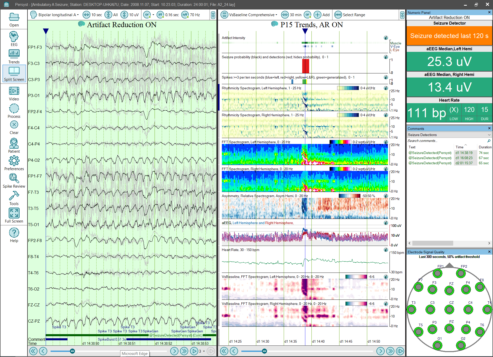

# Seizure Review

# **Seizure Review**

Persyst Seizure Detections can be reviewed from the
Persyst 15 trend window
or the Persyst Comment List.

**Trend window:**
Click the **Show Trends**
button on the System Button Bar, and then page through the trend using the scroll bar at the bottom of the trend window. Click on any point of interest on the trend (e.g., an increase in the Seizure
Detection
trend or an indication of an evolving rhythmic pattern on the Rhythmicity Spectrogram, or other changes of interest). Click on the **Show EEG**
button on the System Button Bar.

**Comment List:**
Click on the **Show EEG**
button on the System Button Bar. Click the **SzDetect**
tab at the bottom of the
Persyst 14
Comment List and the EEG waveforms at the seizure detection will be displayed.

Note that seizure detections have a minimum duration of 1
1
seconds. Inter-ictal bursts of shorter duration will not be marked as seizures by the Persyst seizure detector.
Click 
HERE
for
information on the performance characteristics of Persyst
Seizure Detection.

