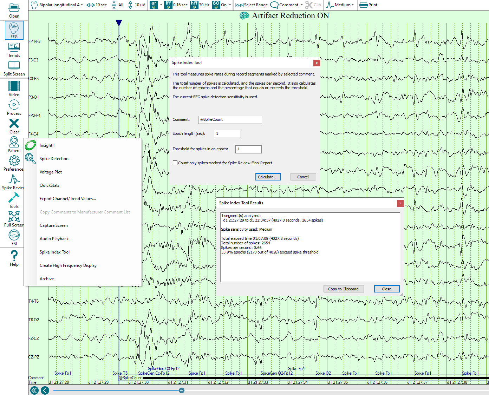

# Spike Index Tool

# Spike Index Tool

After processing an EEG recording with
Persyst 15, the spike detections are available for quantifying using the Spike Index Tool. This tool measures the spike rates during recordings marked by the selected duration comment. 
The total number of spikes is calculated, and the spikes per second. It also calculates the number of epochs and the percentage that equals or exceeds the threshold.

The default comment is "@SpikeCount", though any comment text can be used. To enter a duration comment, use the Select Range button. Page forward to the desired end duration and then select the Comment button. Enter the desired text to create the duration comment (e.g., @SpikeCount) and then OK.

Count only spikes marked for Spike Review: Selecting this option will restrict the spike index calculation to include only spikes that have been selected in Spike Review and that appear on the Final Report tab.

