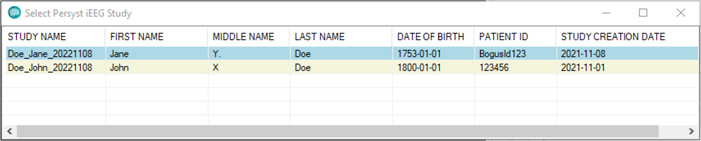

# Loading Existing Studies

# **Loading Existing Studies**

Once a study has been created, it can be reloaded for review or editing. To do this select the File dropdown menu from the PIW Menu Bar and select Load Persyst Imaging Study. Subsequently, select the study you wish to work with from the list of all existing studies that appear.

