# PIW Study Creation: iEEG Electrode Localization

# **PIW Study Creation: iEEG Electrode Localization**

The PIW is primarily designed to locate the positions of intracranial electrodes in postimplant imaging and rendering those locations on preimplant imaging so that the approximate anatomical locations and spatial arrangement of electrodes can be used to help interpret intracranial EEG (iEEG) data. This procedure is carried out as follows:

1) Create an iEEG montage has been generated for the patient as described in this manual under Create Intracranial Montage

2) Start the PIW by either double-left clicking on the Persyst Intracranial Electrode Localization desktop icon or selecting Intracranial Electrode Localization from the Tools menu in Persyst.

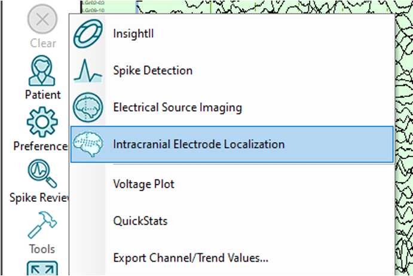

3)  The PIW should open along with a window listing the available studies. You will then see a list of all previously created studies. Entering text in the box next to the magnifying glass shows only studies that contain that text. Clicking on the columns sorts the rows by that variable. Double left-click on the desired study.

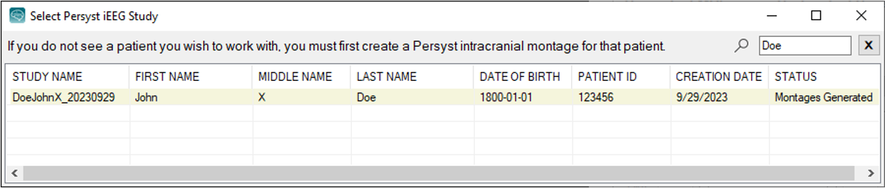

4) Import the preimplant MRI as the primary imaging volume. The spatial resolution of the MRI needs to be 1.5 mm or less in each axis. For intracranial electrode localization, the MRI should have been acquired without contrast media, as contrast can interfere with the segmentation of the cerebral hemispheres used for 3D electrode visualization. You can import the imaging in DICOM or NIfTI format. In addition, if any imaging has previously been imported for this patient, you can simply re-use it by accessing the Persyst Database. Choose which format you wish to import from the data source menu and then browse to file(s) you wish to import::

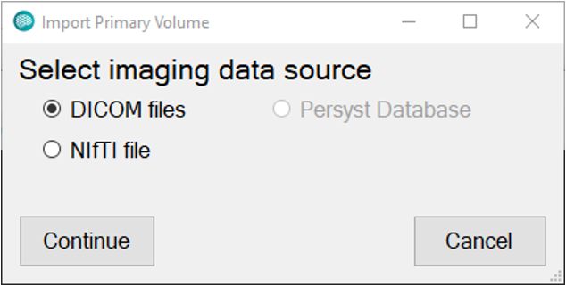

5) Once the preimplant imaging format and file location have been selected, you will be a provided a list of available imaging along with an interactive simple 2D rendering of the image contents. Select the preimplant imaging series you wish to use and click Import Selected Series:

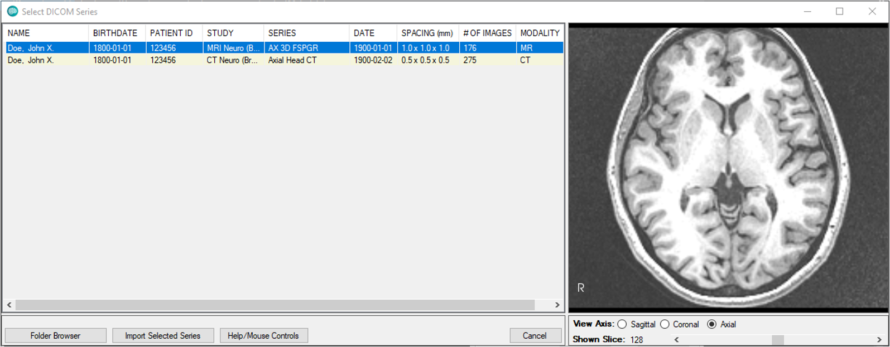

6) Repeat the imaging import procedure for an imaging volume that has been acquired while the iEEG electrodes were implanted. Either an MRI or CT volume will suffice, though marking electrode locations in a CT scan will likely be faster. The spatial resolution of the postimplant imaging needs to be 1.5 mm or less in each axis.

7) After the postimplant volume is imported, you will be presented with the study patient and data information that has been extracted from the imaging. The Study Creator field should be the name of the user creating the study. Check this for accuracy and correct any errors or missing information.

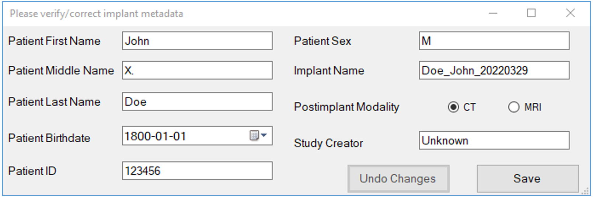

8) The postimplant imaging volume will then be rigidly automatically aligned to the preimplant volume via an affine transformation. Once the alignment is complete, the user will be presented with an array of 2D images showing the edges of the postimplant volume overlaid on the preimplant volume. This allows users to assess the quality of the alignment. If the two volumes are well aligned, click the Alignment OK button to proceed. Otherwise, click the Run Landmark Alignment button to manually mark anatomical landmarks on each volume and to re-align the volumes via these landmarks.   
  
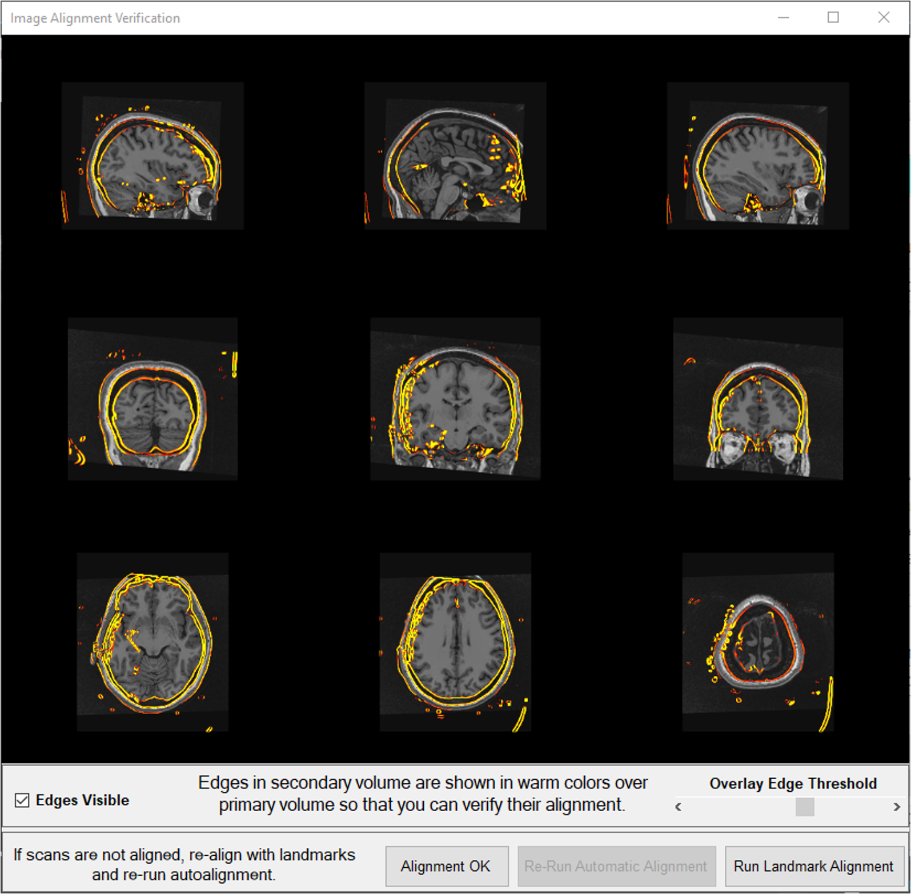

9) Subsequently, if the postimplant imaging is a CT volume, a set of instructions for thresholding the CT scan to aid electrode localization will appear:

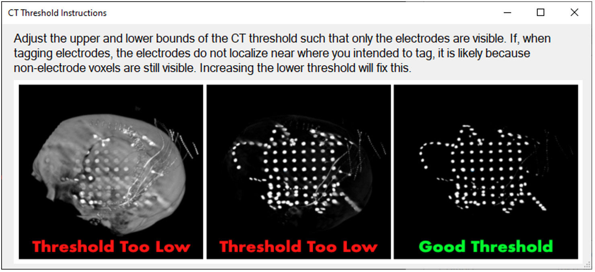  
  
10) Now you can begin tagging the locations of electrodes in the postimplant volume. This can be done in either 3D volumetric or 2D views. By default, the 3D volumetric view is initially rendered:  
  
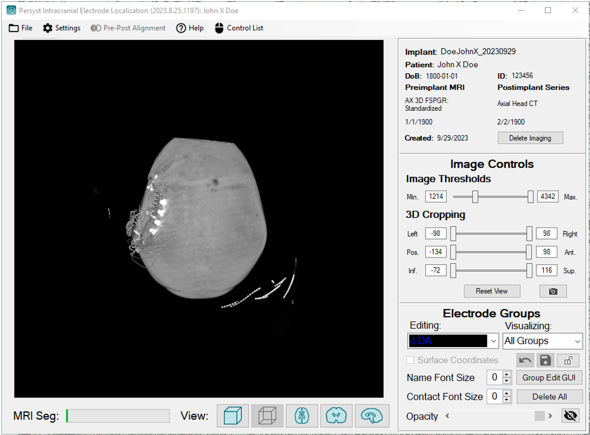  
  
Note, the green progress bar in the bottom left corner of the interface. It tracks the segmentation of the brain from the preimplant MRI, which takes place in the background as you mark electrode locations. Once the segmentation is complete, the progress bar will be replaced by buttons that allow you to choose which imaging volume you wish to view (postimplant CT/MRI, preimplant brain, preimplant MRI).

11) The postimplant volume can be thresholded and cropped via the range sliders in the Image Controls panel to show just the locations of the electrodes:

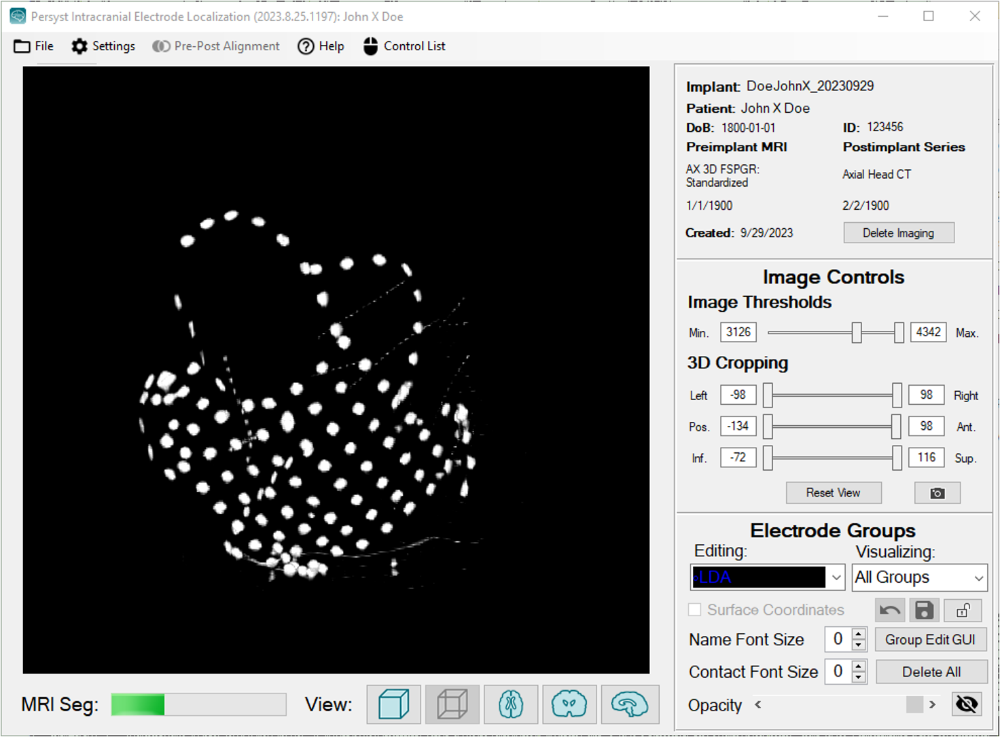

12) Select which group you want to localize via the Editing dropdown menu in the Electrode Groups panel.

When an electrode group is selected for editing, the following window appears that allows users to edit the properties of individual contacts in the electrode group:

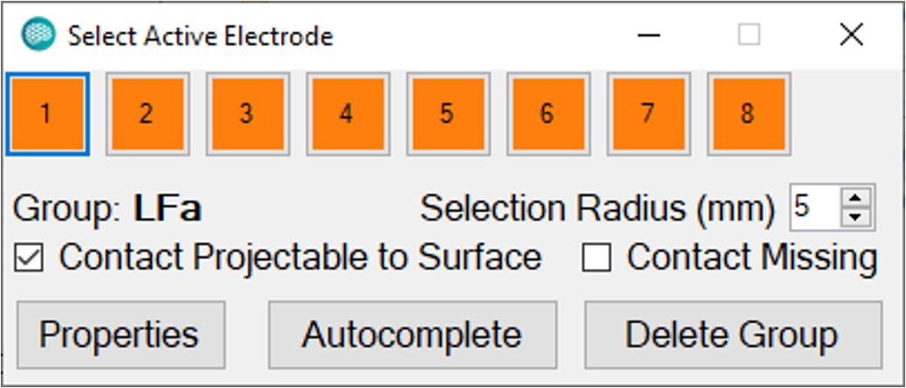

Each contact in the group is represented by a numbered square. The square with the blue outline is the contact currently being edited. If you Right-Click on the image the active electrode will be assigned the position that was clicked on. This coordinate is derived by finding the center of mass of all voxels within the current Selection Radius. You need to manually tag two or more contacts in each strip or depth; the manually tagged contacts should define the curve of the hardware group like so:

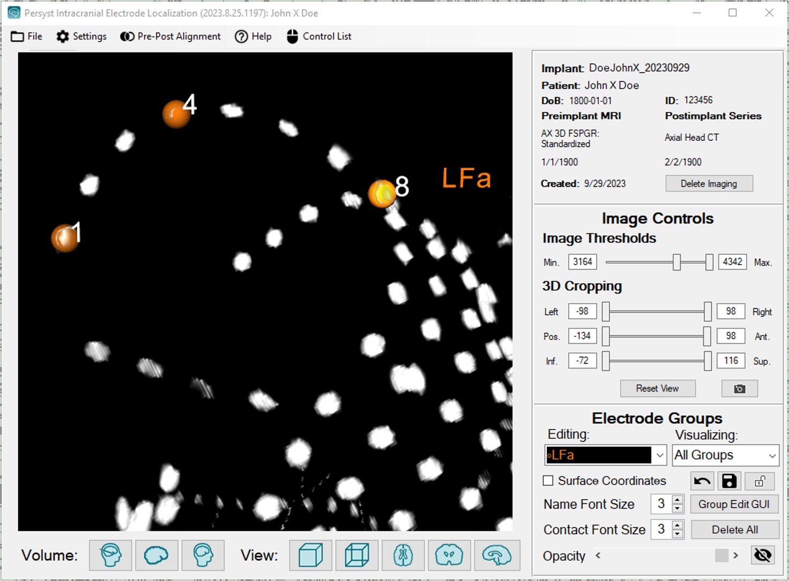

Note, that one can render the name of each electrode group and the contact numbers by setting their font sizes to values greater than 0 in the Electrode Groups panel.

Consequently, the rest of the contact locations can be automatically tagged by pressing the Autocomplete button or Ctrl-Right-Click.

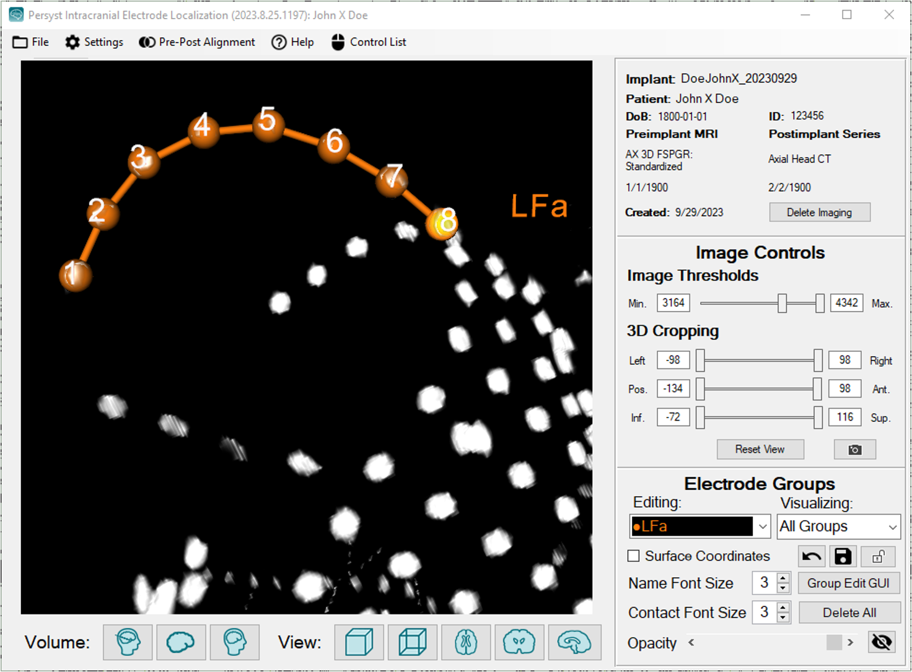

For grids of iEEG electrodes, you should tag at least three contacts in the three columns or three rows (i.e., 9 contacts total) for autocomplete to work well. If any electrodes in the group have been cut out from the group, click the Contact Missing checkbox to hide this contact from visualization.

Note, autocompletion relies on the inter-contact distance of the electrode group. This parameter was set at the time of montage generation. However, if you are unsure of the intercontact distance, you can tag two or more neighboring contacts in a group and estimate the intercontact distance by clicking on the Properties button in the Select Active Electrode window. Then, in the Electrode Group Properties window that subsequently opens up, click Estimate Spacing:

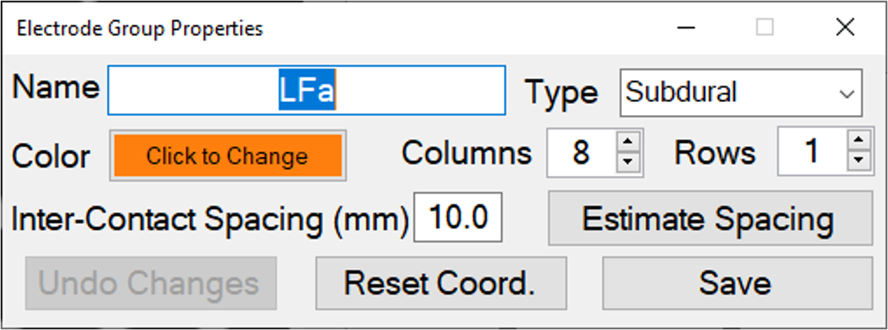

13) If any electrode groups were not recorded in the iEEG record used to generate the study, they will not appear in the Editing drop down menu. To add such groups or to create functional groups of electrodes that you would like to visualize (e.g., seizure onset electrodes), select Create new group from the Editing drop down menu:

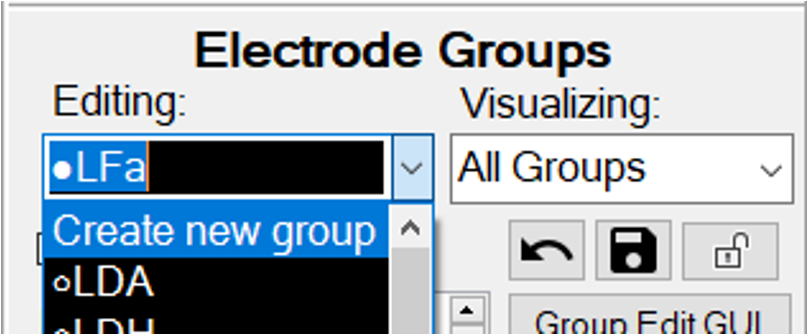

14) Once the electrode positions have been tagged, click the lock button in the Electrode Groups panel to prevent any further changes. Now, electrode locations  can be visualized in 3D on the preimplant brain or semi-transparent brain surface:

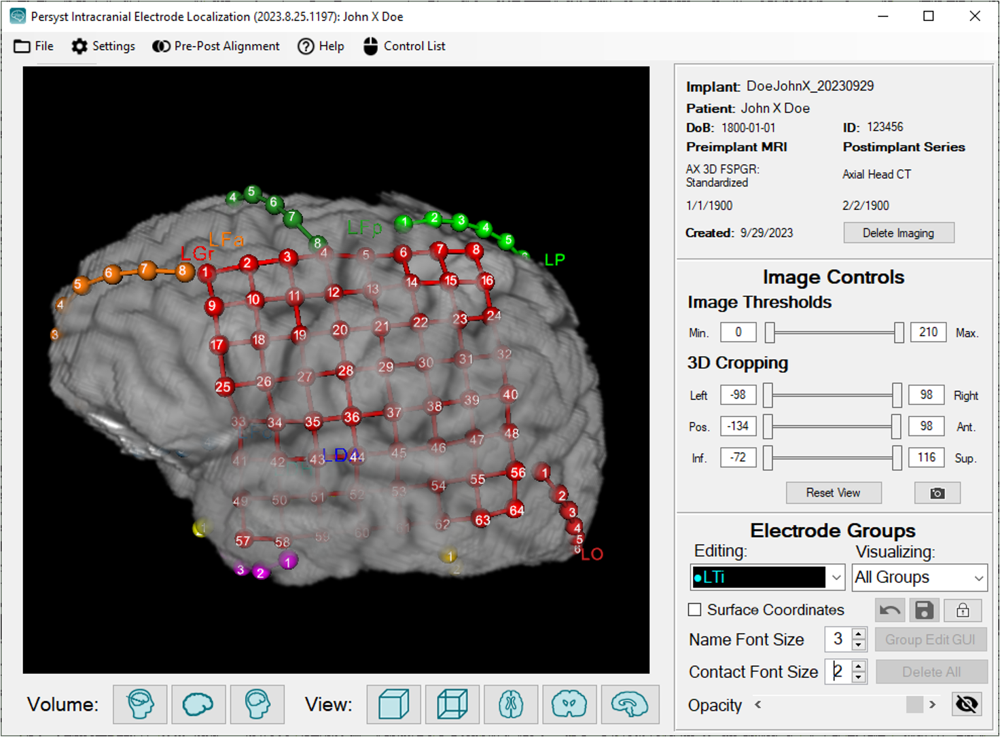

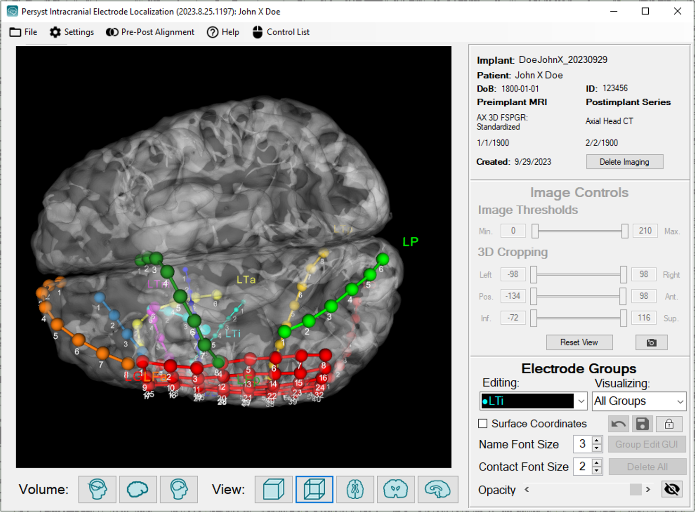

Electrodes that lie within the preimplant brain volume can be projected out the surface to aide visualization via the Show Surface Coordinates checkbox in the Electrode Groups panel. This is only a visualization aid and the projected anatomical locations should not be interpreted as accurate. If any contacts are poorly projected to surface, projection for individual contacts can be disabled via the Select Active Electrode pop-up window.

Electrode locations can also be rendered on the preimplant volume in 2D sagittal, coronal, and axial planes:

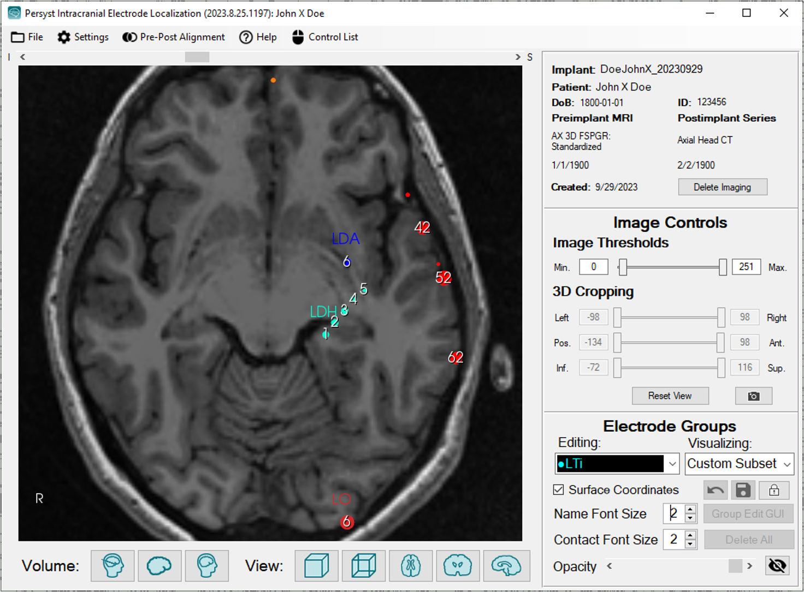

15) Electrode locations can be exported either in DICOM format or as a text file. For the former, select Export Locations to DICOM from the File dropdown menu. This will produce a series of DICOM files with the location of each electrode in the preimplant volume represented with a cube of the value of maximal volume brightness. For the latter, select Export Persyst Imaging Study from the File dropdown menu in the PIV Menu Bar.