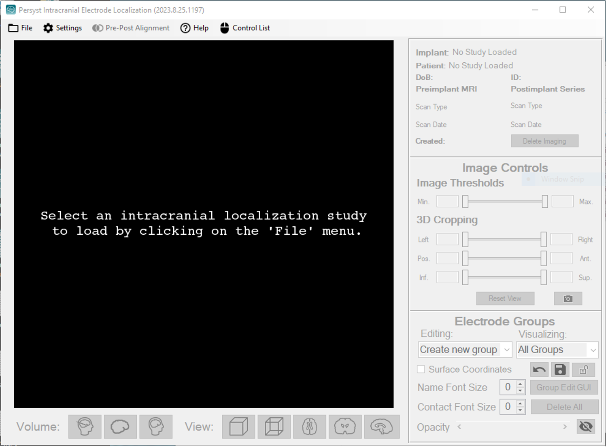

# Persyst Imaging Viewer

# **Persyst Imaging Workflow**

The PIW program looks like this when first launched:  
  

In addition to the large, black window where images are rendered, the PIV consists of the following four sets of controls and panels.  
  
1) PIW Menu Bar  
  
At the top of PIW is the Menu Bar that contains the following dropdown menus.

File: Allows users to load a previously created study from the Persyst Imaging Root Directory, to delete studies, and to export a study in Persyst or DICOM format.

Settings: Allows users to edit PIW settings like default intracranial electrode type and contact spacing

Pre-Post Image Alignment: Allows users to align a postimplant secondary image in a study to the preimplant image automatically or via manually chosen landmarks. It also allows users to generate images of the secondary volume overlaid on the first volume to judge the accuracy of alignment.

Help: Opens a window that lists instructions for using the application.

2) Study Information Panel  
  
At the top right of the PIV is a panel detailing the study name, patient identifying information, and imaging details.

3) Image Controls

The middle right panel contains controls for thresholding and cropping imaging, resetting view parameters, and taking screenshots.

4) Electrode Groups Controls

The bottom right panel contains controls for creating and editing groups of intracranial electrodes. An electrode group can consist of a physically connected set of electrodes (e.g., all the contacts on a penetrating depth or subdural strip electrode), a functional group of electrodes (e.g., all the seizure onset electrodes), or a set of desired electrode locations.

The Editing dropdown menu shows the electrode group currently being edited and allows users to create new electrode groups. The Visualizing dropdown menu allows users to choose which electrode groups are currently visible. The Group Edit GUI button opens a window for editing the properties of the active electrode group. The Delete All button deletes all electrode groups. The Undo and Save Changes button will undo and make permanent any changes to the electrode groups. The lock button will mark the study as complete and prevent changes to the electrode locations and properties.

Name and Contact Font Size controls allow users to render electrode group names and contact numbers on the imaging in various sizes. If checked, the Show Surface Coordinates text box will project subdural electrode locations out to the surface of the brain to aid their visualization. This is to accommodate for the brain shift typically caused by subdural electrode implantation, which leads to electrodes lying within the brain volume of preimplant imaging.

Finally, the Opacity scroll bar controls the transparency of electrode representations overlaid on the imaging. The eye button toggles the visibility of the electrodes.

5) View Controls

The Volume buttons at the bottom of the interface allow users to select the postimplant imaging, preimplant brain, or complete preimplant imaging for viewing. The View buttons determine how that imaging will appear. The solid cube selects a volumetric 3D rendering. The transparent cube renders the cerebral surface transparently. The remaining buttons visualize two dimensional axial, coronal, or sagittal slices through the volume.