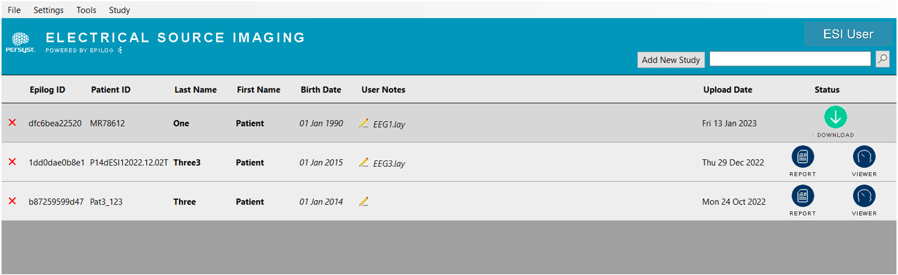
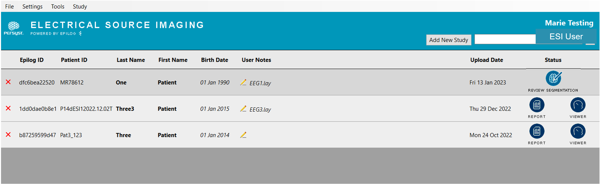

# Accessing Results

# Accessing Results

When results are ready, users will receive an email that the results are ready for review. To access results, launch Persyst ESI powered by Epilog. The **Status** will be a green **Download** button.

  
*Status change to****Download***

  
*After downloading, the status changes to **Review Segmentation***