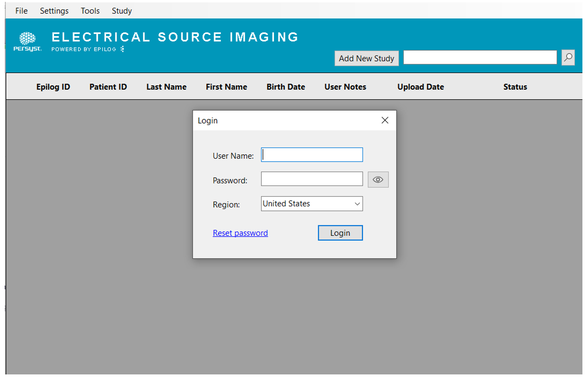
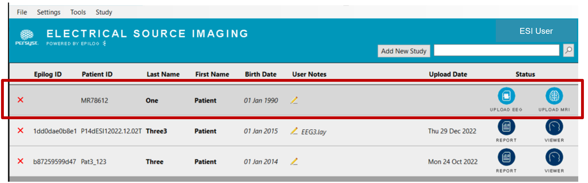
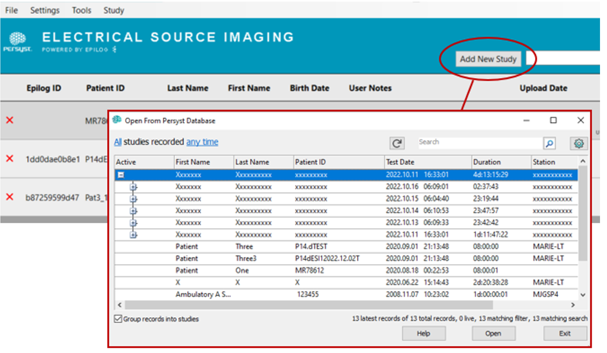

# Creating an ESI study

# Creating an ESI study

Persyst ESI powered by Epilog is launched either from **Tools** on the Persyst **System Button Bar**, or from the Persyst ESI **desktop icon**.

 *Login to Persyst ESI.*

  
*Launching Persyst ESI via Tools from the Persyst button bar; the patient whose record is open in Persyst appears in the list ready for upload.*

  
*Launching Persyst ESI via desktop icon; **Add New Study**, select a patient and click **Open** to add that patient to the ESI list, ready for upload.*