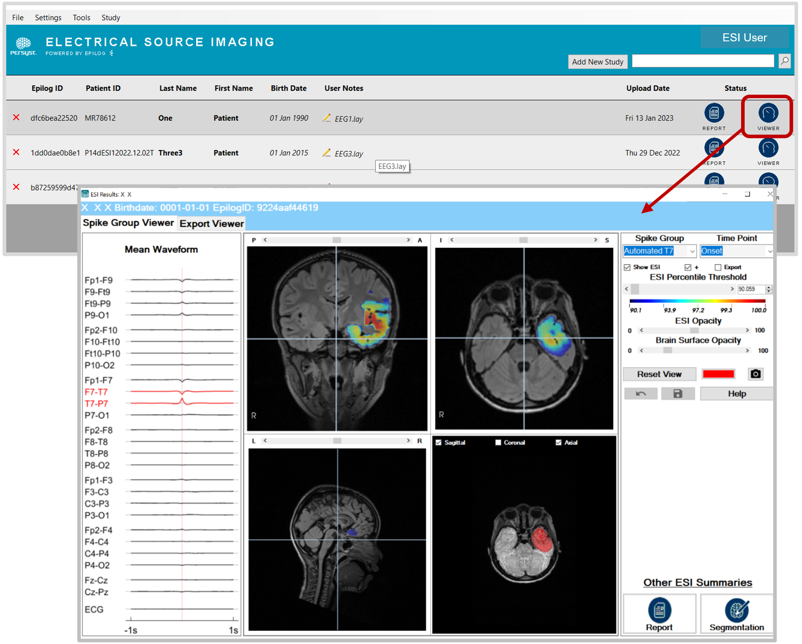

# ESI Results: Image Viewer

# ESI Results: Image Viewer

The **ESI Results** **Image Viewer** is launched by pressing the **Viewer** button from the ESI patient list, as seen in the image below. The **Spike Group Viewer** tab shows the ESI results of a given average spike waveform at a given time point as an overlay on the patient’s own MRI with the waveform of the average spike shown on the left panel. The **Spike Group** and **Time Point** dropdown menus allow the user to change the spike group and time point. 

The ESI results have a threshold applied such that only the highest 10% of the calculated results are shown. The threshold and opacity can be changed using the **ESI Percentile Threshold** and the **ESI Opacity** slider bars.

  
*The **Spike Group Viewer** tab of the **ESI Results Image Viewer** allows visualization of ESI results for the average waveform of a given spike group at a given time point in the **axial**, **sagittal** and **coronal** planes in the patient’s own MRI. **Scroll through the slices** using the mouse scrolling wheel. The **3D view** (bottom right) includes all three planes intersecting on the patient’s 3D cortical surface, which can be **rotated** by clicking and dragging. **Zooming in and out** can be done by using the mouse scrolling wheel.*