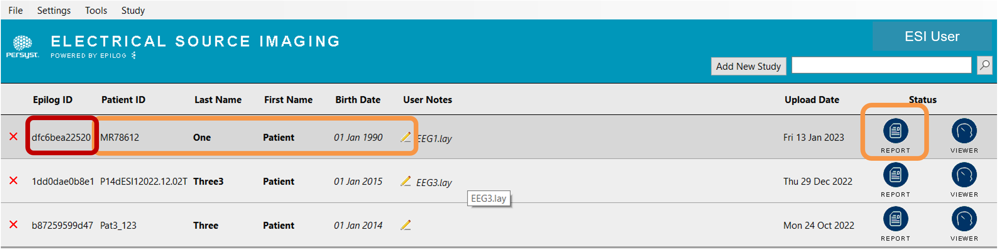
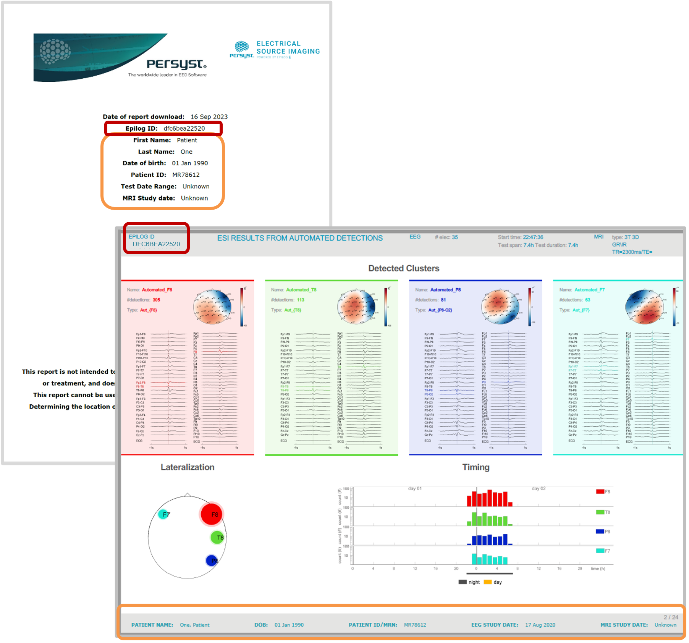

# ESI Results Structure

# ESI Results Structure

The **Report** button opens the PDF ESI results. The **Viewer** button opens the static Image Viewer with the ESI results overlaid in the patient’s own MRI.

**ESI Results: the PDF**

Persyst ESI powered by Epilog facilitates the automatic deidentification of EEG and MRI data prior to upload to the secure cloud server.

The **Epilog ID** is the unique identifier assigned to a patient data set after upload for reference purposes.

The **Persyst ESI Patient List** on the local workstation(s) is the only place where the Epilog ID and the patient information are stored together.

When the user initiates the download of the ESI results to the local workstation, the patient information is added back to re-identify the PDF report in a title page and in the footer of each page in the PDF.

  
*The ESI Patient List. The Epilog ID is in the left column. Patient information is in the columns to the right. When a report is downloaded by the user and the Report button is clicked, the re-identified PDF of the ESI Results for that patient data set opens, as seen below.*

**

**When the user initiates the download of the ESI results, ESI Patient List will edit the deidentified PDF report by correlating the Epilog ID back to the corresponding patient information. A title page with the patient information is added to the PDF and the patient information is also added as a footer to every page in the PDF.**   
  
**Refer to the ESI PDF Report Interpretation Guidelines for more information**  
https://persystesi-information.s3.amazonaws.com/Guideline\_Report\_Interpretation%2BPersystESI.pdf