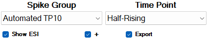
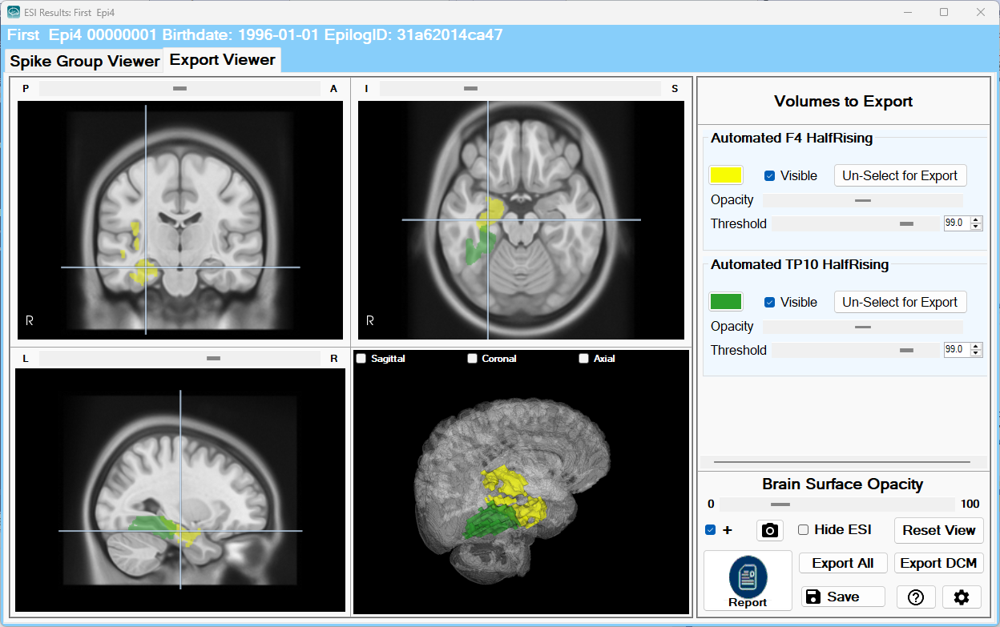
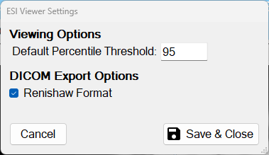

# Export to DICOM

# Export to DICOM

The ESI results are co-registered to the structural MRI and can be exported to DICOM format.

To choose an ESI volume for export, check the **Export** box. Do this for each ESI volume associated with a spike group and time point of interest.

The **Export Viewer** tab allows for the final review and export of the ESI volumes selected for export in the Spike Group Viewer tab. The **Export DCM** button exports a thresholded, binary ESI volume merged to the MRI. 

  
*The **Export Viewer** tab allows visualization of the selected volumes to be exported. Results can be exported to a user-defined location in DICOM format by clicking the **Export DCM** button. The **Export All** button saves the ESI results in a user-defined location in NIfTI format.*

Note that Renishaw’s Neuromate software has some unique DICOM requirements.  If you want to import the ESI DICOMs into Neuromate, you need to click the Settings button (i.e., gear icon) in the Export Viewer tab and check the Renishaw Format before creating the ESI DICOMs.

