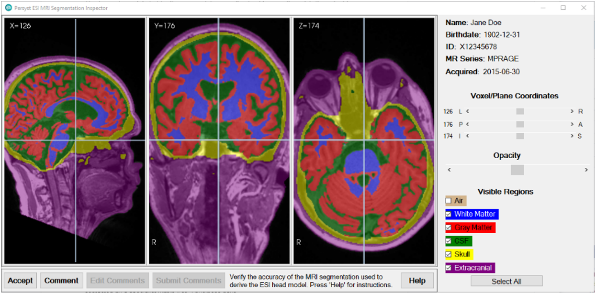
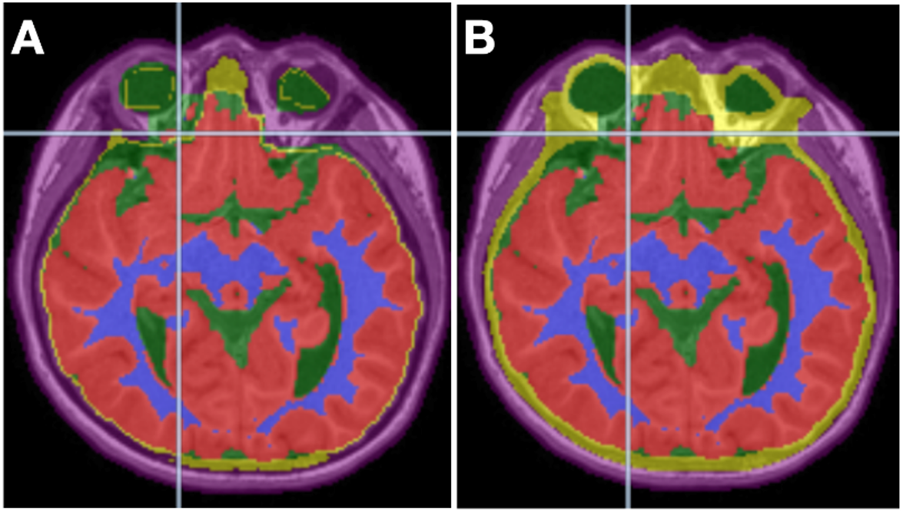
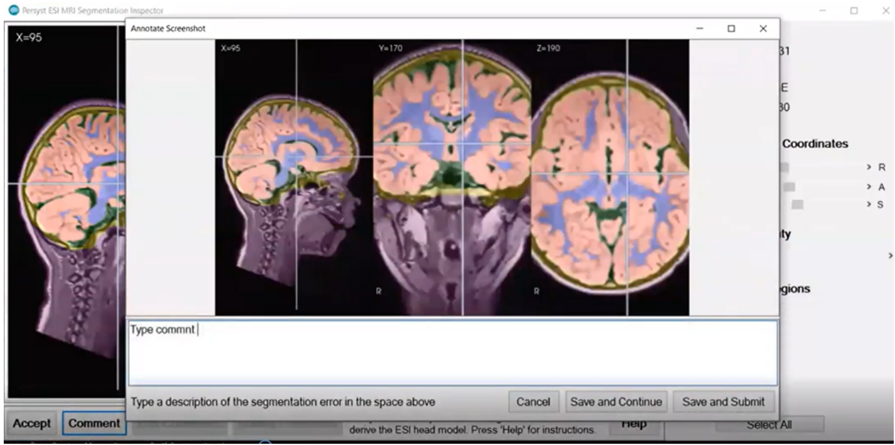
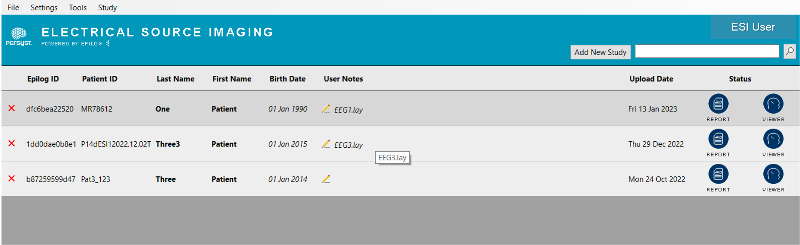

# MRI Tissue Segmentation Inspector

# MRI Tissue Segmentation Inspector

Clicking the **Review Segmentation** button will launch the **MRI Tissue Segmentation Inspector**.

Figure 18: The MRI Segmentation Inspector user interface.

Inspect the MRI segmentation results to verify that there are no significant errors by adjusting the overlay transparency (via the Opacity slider control) and scrolling through the MRI volume. The tissue types labeled by the segmentation results should generally match the actual tissue types that can be visualized on the patient’s MRI. A significant error would be a mislabeling of a tissue type across many voxels. For example, if an area of tissue that is seen as gray matter in the MRI was erroneously labeled skull in the segmentation results.

In the ESI calculations, the solution space is constrained to the gray matter, excluding the cerebellum. To ensure a good solution space throughout the brain, the gray matter in the head model is slightly inflated. The gray matter (solution space) is then divided into voxels with dipoles where the distance between dipoles is 4mm.  Each potential dipole is calculated to have a level of relative current at a given time point. 

In the head model, we use the same electrical conductivity for gray matter and white matter, so mislabeling between gray and white matter does not impact the solution much. 

In contrast, the skull segmentation is critical to the head model because the skull (bone) has the lowest conductivity in the head. There should be no holes in the skull because this would affect the localization in the underlying region. 

Figure 19: In the figure above, Image A is an example segmentation that has underestimated the thickness of the skull and should be flagged for revision. Next to it Image B shows an acceptable segmentation of that same plane of the MRI with the skull voxels accurately labeled. The skull in these images is represented with yellow.

If the tissue segmentation generally agrees with the MRI, the results can be accepted by clicking **Accept**. If there is a significant error, submit at least one comment by clicking **Comment.** Clicking the **Comment** button will capture a screenshot of the current view, which you can annotate with text. Ensure the view is centered on or near the area needing revision. After you have commented on how the segmentation needs to be changed, follow the prompts to submit the comments. 

Figure 20: Writing feedback after clicking Comment in the MRI Tissue Segmentation Inspector. Clicking Save and Continue allows the user to enter more Comments. Save and Submit will submit for revision. 

After the user submits comments for revision, the following message will appear: “Thank you for your comments. You will receive a revised segmentation to download or be contacted by a specialist within 1 to 2 business days.” The **Status** in the ESI patient list will once again switch to **Processing**.

The MRI tissue segmentation will be recalculated according to your comments. You may be contacted to provide additional information if necessary. Users at the institution will receive another email alerting them the new results are ready. The **Status** in the ESI patient list will once again be set to **Download** and the process will be reiterated until the results are accepted.

# When the MRI Tissue Segmentation results are accepted, the Status column will directly change to two buttons; Report and Viewer.

Figure 21: Status change to Report and Viewer.