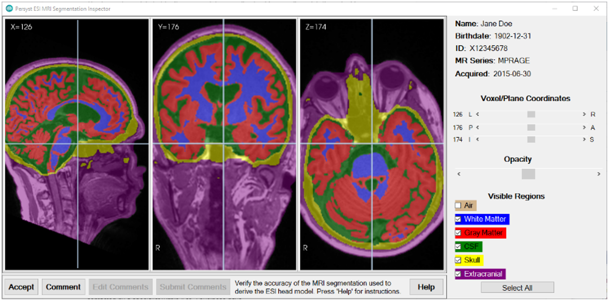
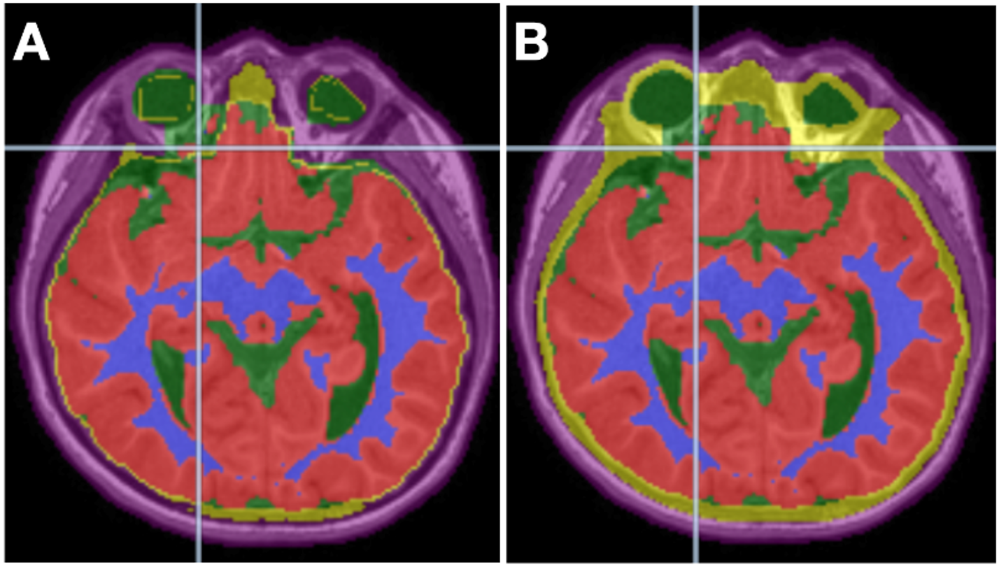
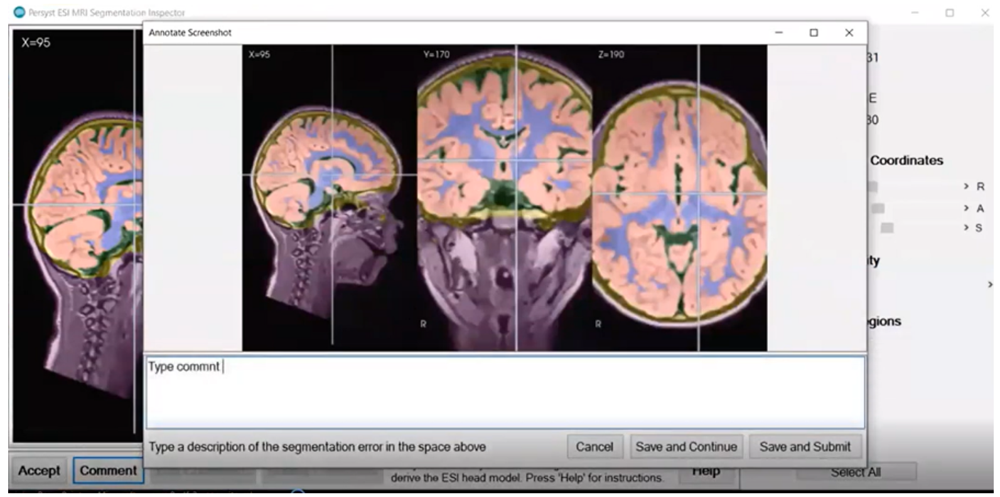
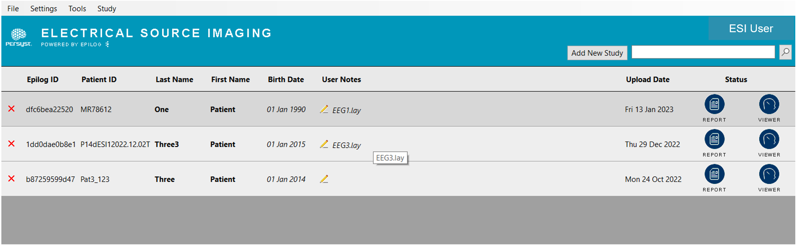

# Review Segmentation and Access Results

# Review Segmentation and Access Results

The **Review Segmentation** step is a preliminary step before reviewing the ESI results.

Click **Review Segmentation** to launch the **MRI Tissue Segmentation Inspector**. The **MRI Tissue Segmentation Inspector** allows the user to assess the general match of the calculated tissue types compared to the tissues as they are seen in the MRI.

  
The **MRI Segmentation Inspector** user interface

Inspect the MRI tissue segmentation results to verify that there are no significant errors. Adjust the overlay opacity and scroll through the MRI volume.

  
***Image A*** *shows an example of tissue segmentation with underestimated thickness of the skull, shown in yellow, which should be flagged for revision. **Image B** shows the same MRI but with the skull segmentation appropriately estimated.*

If the tissue segmentation generally agrees with the MRI, accept the results by clicking **Accept**. If there is a significant error, click **Comment** to capture a screenshot of the current view, and then annotate with text. Follow the prompts to submit the comments, which will send the tissue segmentation back for revision.

  
*Writing feedback after clicking **Comment** in the MRI Tissue Segmentation Inspector. Clicking **Save and Continue** allows the user to enter more Comments. **Save and Submit** will submit for revision.*

After the user submits comments for revision, the **Status** in the ESI patient list will once again switch to **Processing**.

The MRI tissue segmentation will be recalculated according to your comments. You will receive another email when the new results are ready. The **Status** in the ESI patient list will once again be set to **Download** and the process will be reiterated until the results are accepted.

When the MRI Tissue Segmentation results are accepted, the **Status** column will directly change to two buttons; **Report** and **Viewer.**

  
*Status change* *to* ***Report*** *and **Viewer**.*