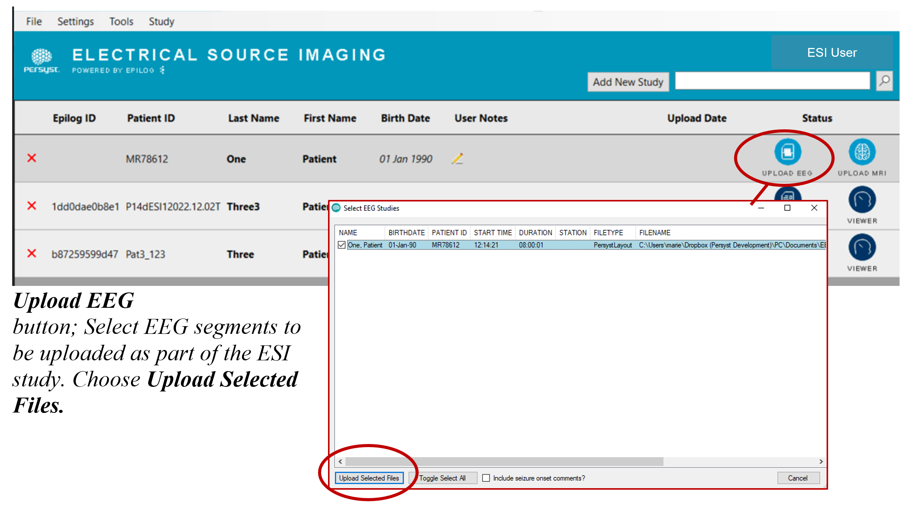
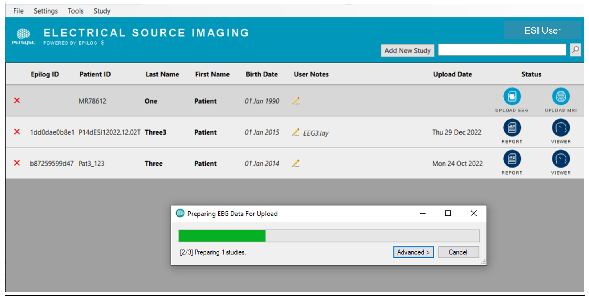
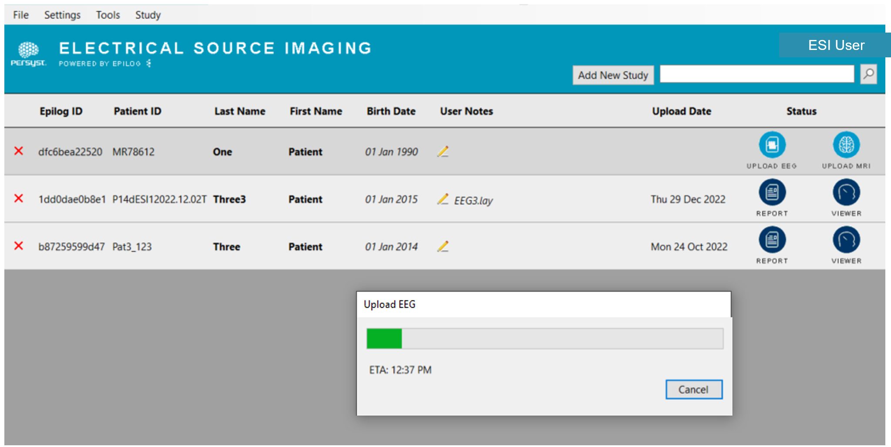
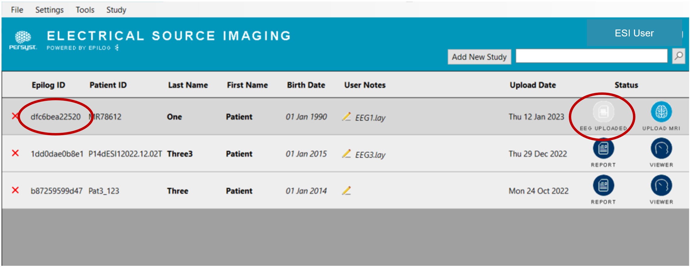

# Upload the EEG

# Upload the EEG

 ***EEG Data for Upload*** *progress bar.*

 *The **Upload EEG*** *progress bar appears next,* *with upload ETA**.*

Wait for both progress bars to finish. Canceling or closing will stop the upload.     

 *EEG upload is complete. Button status is now **EEG Uploaded** and the Epilog ID is populated.*