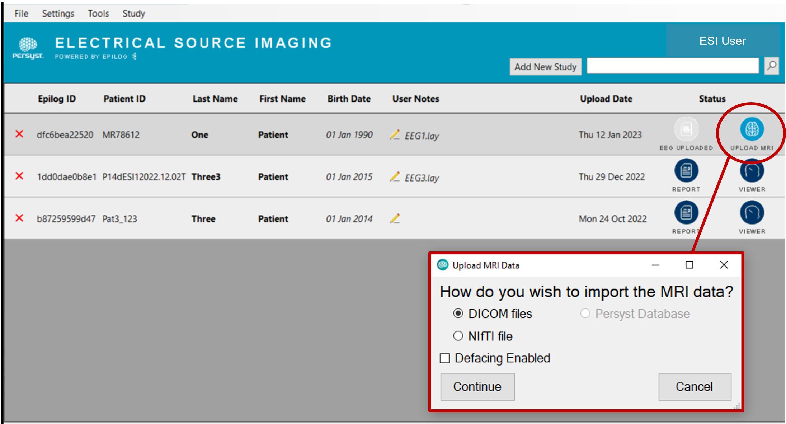
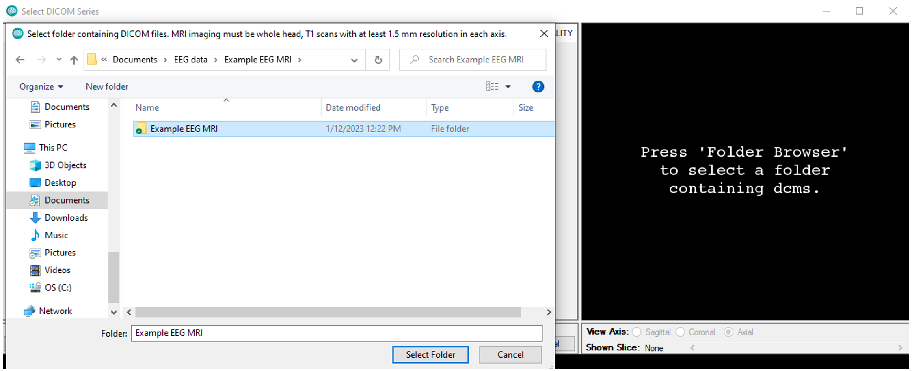
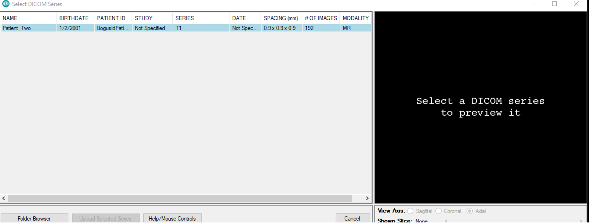
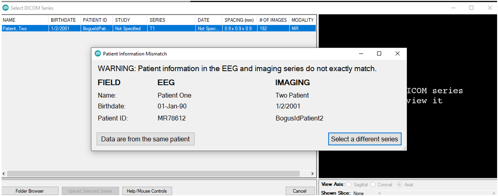
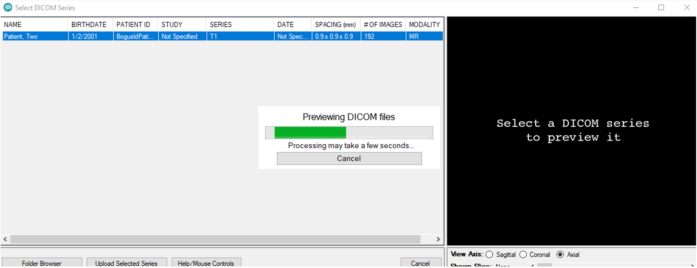
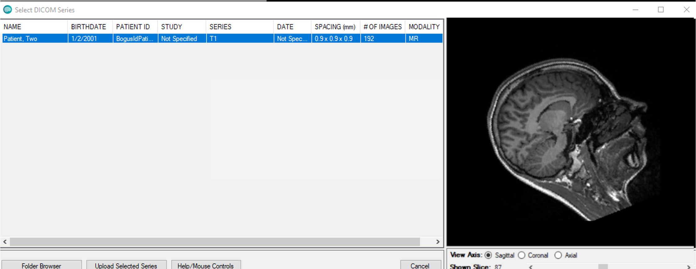
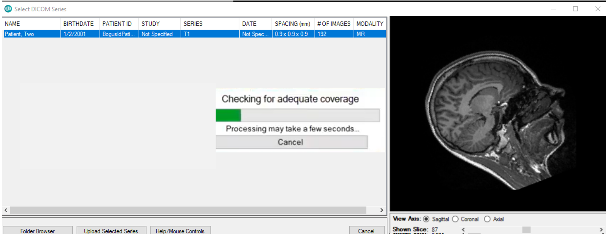
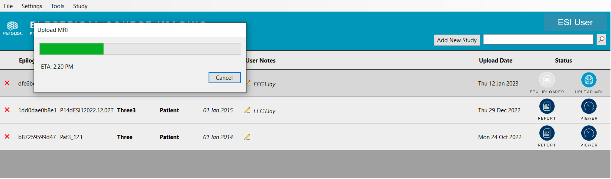
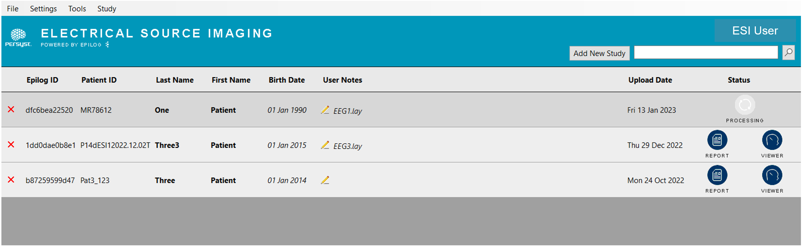

# Upload the MRI

# Upload the MRI

 *Click **Upload MRI** and Select DICOM or NIfTI.*

If DICOM format, navigate to and click to select the **folder** containing the DICOM series. If NIfTI format, select the .nii **file** that corresponds to the MRI data. Click **OK.**

 *Navigate to the folder containing the DICOM series and click **Select Folder**.*

Wait for the program to scan the folder. MRI studies will be displayed as line items in the resulting list. In the example in Figure 10, there was only one MRI study in the folder.

  
*List of MRI studies in the folder. Click to select one for upload.*

  
*Patient information mismatch warning. Choose **Data are from the same patient** if this is true.*

  
*Previewing DICOM files progress bar.*

  
*Preview the study prior to upload. Click **Upload Selected Series** to upload the MRI.*

  
*The program checks that the head coverage is adequate.*

  
*After adequate coverage is confirmed, the MRI series uploads.*

  
*After upload, ESI study status is **Processing.** Expect results are ready within 2 business days.*