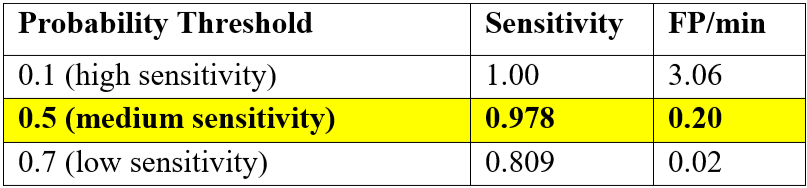
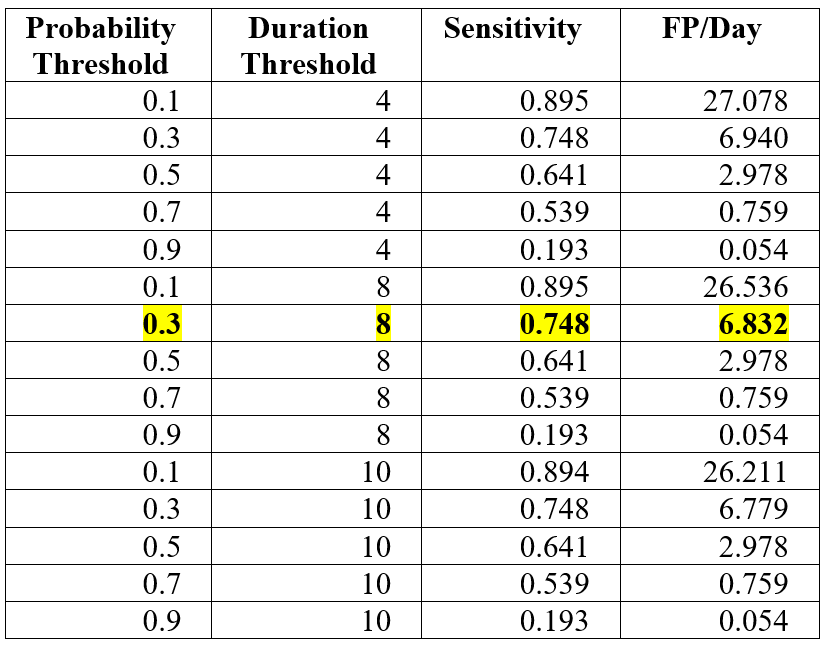
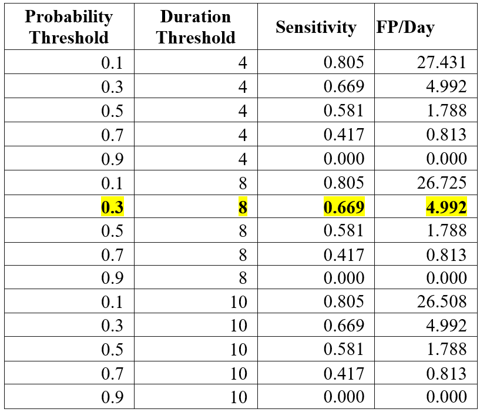
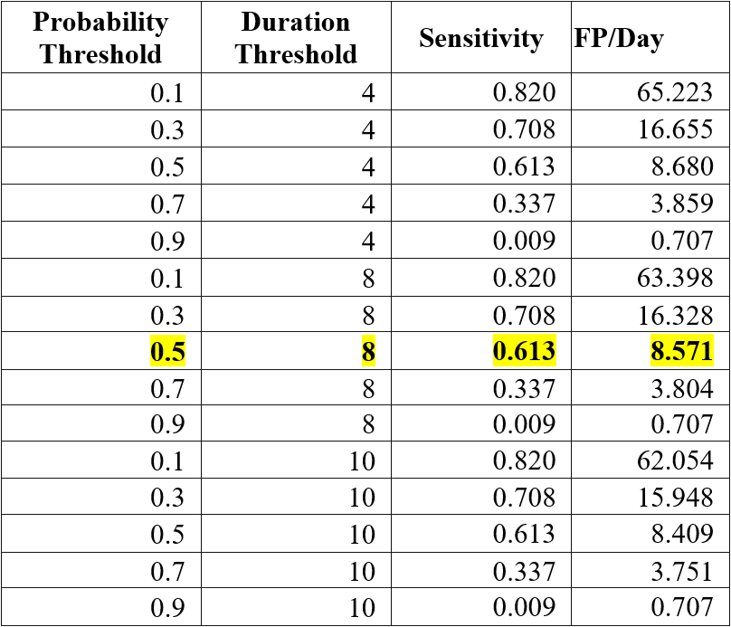

# Performance Testing

# **Performance Testing**

**Appendix A**

# **Performance****testing - CLINICAL / NON-CLINICAL**

# **Artifact Intensity**

Many varieties of artifacts and non-artifact cerebral signals occur in Persyst’s library of EEG records. A subset of these events have been identified and marked by two board-certified experts in EEG interpretation.

Both true positive and true negative cases were collected from the same set of records. The cases were divided into training and testing sets. For each set, the sensitivity is calculated as the number of matching (detection time within 0.1 s) algorithm detections divided by the number of true positives. The specificity is calculated as the number of matching (detection time within 0.1 s) algorithm non-detections divided by the number of true negatives.

**Electrode Artifact Testing**

Electrode Artifact Testing – Segments were extracted from 159 patient records.  Experts marked 109,854 electrode artifact events (1 second epochs) in 67 records.  The experts did not mark any electrode artifacts in 92 records.  There were a total of 643,371 non-electrode artifacts marked across all records.  Testing for both sensitivity and specificity was done across all 159 records.

The result of testing:

Sensitivity = 98.7%

Specificity = 99.9%

**Vertical Eye Artifact Testing**

Vertical Eye Artifact Testing – Segments were extracted from 56 patient records.  Experts marked 413 vertical eye events in 21 records.  The experts did not mark any vertical eye events in 35 records.  The experts marked a total of 3003 negative events across the 56 records.  Testing for both sensitivity and specificity was done across all 56 records

The result of testing:

Sensitivity = 93.2%

Specificity = 99.0%

**Lateral Eye Artifact Testing**

Lateral Eye Artifact Testing – Segments were extracted from 34 patient records.  Experts marked 136 lateral eye events in 13 patient records.  The experts did not mark any lateral eye events in 21 records.  The experts marked a total of 476 true negative events across the 34 records.  Testing for both sensitivity and specificity was done across all 34 records.

The result of testing:

Sensitivity = 87.5%

Specificity = 97.3%

**Artifact Reduction**

The validation technique used is very similar to the technique presented in DeClercq 2006 and Gao 2010. We improved on DeCler
c
q by increasing the number of patients, and the number of artifact-free and artifact segments. We improved on Gao by using data from records recorded in an EMU setting. In an improvement on both studies we added a distortion test where the filters are run against artifact-free segments to verify that they minimally change those segments.

AR provided less distortion than the pass-fail criteria.

141 artifact-free "normal" 30-second segments from 9 different patients.

Total of 26,790 epochs analyzed.

Distortion from the AR method, calculated as median signal-to-noise ratio, is over 40 times lower than the distortion from the standard 15 Hz high-cut filter.

AR provided a better Artifact Reduction Rate (improvement in SNR) for every type of artifact than the pass-fail criteria.

141 artifact-free "normal" 30-second segments from 9 different patients. 103 artifact segments (30 lateral eye, 39 vertical eye, 34 muscle, each type from 10 different patients), duration 5-10 seconds.

Reduction rate with AR method was higher than Baseline Accuracy of 2.86 for every type of tested artifacts. Median reduction rate over all tested samples was 7.82 

**Spike Detection**

The total set of records used for training and testing are:

50 clinical recordings/patients, 0.5-66 year, 4.1 hours, 1952 spikes marked by five readers with perception values.

277 EMU recordings/patients, 204 adult and 73 pediatric, 226.3 hours, 31,265 spikes marked by two-reader consensus with perception values.

14 non-spike EMU records/patients, unknown ages, 76.7 hours. (These records were chosen to supply a broad range of artifacts.)

All records were standard 10-20 scalp recordings. No intracranial data was used. Training and testing sets were split by using odd and even numbered records. No significant difference was found in the training and testing results.

The 277 EMU recordings were consensus-marked by two readers -- marked by one and reviewed by the second. These readers were not part of the generalization study. Additionally, this type of consensus marking does not allow for the calculation of the inter-reader correlation, so Persyst estimated the reliability coefficient of this study by using the worst, average and best inter-reader correlation from the generalization study.

Sensitivity and false positive rate of the spike detector are calculated by processing 331 record in the test data set and comparing results to human reader marks. Results depend on user-selectable probability threshold. Raising the threshold lowers number of false positives but also decreases sensitivity. At the recommended threshold, Persyst 15 false positive rate is below 0.4 per minute and the sensitivity is above 0.95.

Results calculated with Persyst 15 Rev. A:

**Seizure Detection**

(Adult, full set montage)  
  
Sensitivity and false positive rate of the adult seizure detector are calculated by processing 85 records in the test data set and comparing results to human reader marks. Results depend on user-selectable probability and duration thresholds.

The overall observed sensitivity (total number of true algorithm detections divided by the total number of seizures, with number of seizures per subject down sampled to six) is 0.851.   The 95% confidence interval of the detection sensitivity, based on 3000 bootstrap replicates using BCa (Bias-Corrected and Accelerated) method, is [0.796, 0.896]. For detection thresholds Dur=6 sec, Prob=0.3 the overall sensitivity is 0.871 with 95% confidence interval [0.820, 0.915].

In the test dataset, seizure detection performed with a mean false detection rate of 0.739 per 24 hours, with its bootstrap standard error equal to 0.27. The 95% BCa bootstrap confidence interval (number of bootstrap re-sampling = 3,000) of the P14 false detection rate = [0.37, 1.57].

The table below shows sensitivity and false detection rates at the allowable threshold settings calculated with Persyst 15. Recommended settings are highlighted.

|  |  |  |  |  |  |  |  |  |
| --- | --- | --- | --- | --- | --- | --- | --- | --- |
| **Default Setting** | **Probability Threshold** | **Duration Threshold** | **Sensitivity** | **Sensitivity   -95%** | **Sensitivity +95%** | **FP/Day** | **FPDay -95%** | **FPDay +95%** |
| 0.1 | 2 | 0.945 | 0.891 | 0.975 | 3.737 | 2.134 | 8.977 |
| 0.3 | 2 | 0.931 | 0.872 | 0.966 | 1.357 | 0.581 | 4.037 |
| 0.5 | 2 | 0.923 | 0.864 | 0.96 | 0.924 | 0.432 | 2.256 |
| 0.7 | 2 | 0.908 | 0.841 | 0.952 | 0.42 | 0.066 | 1.265 |
| 0.9 | 2 | 0.847 | 0.762 | 0.898 | 0.186 | 0.049 | 0.486 |
| 0.1 | 8 | 0.945 | 0.892 | 0.973 | 3.134 | 1.818 | 6.538 |
| 0.3 | 8 | 0.932 | 0.871 | 0.966 | 1.104 | 0.506 | 2.86 |
| **0.5** | **8** | **0.923** | **0.859** | **0.96** | **0.739** | **0.372** | **1.574** |
| 0.7 | 8 | 0.908 | 0.846 | 0.953 | 0.334 | 0.049 | 1.187 |
| 0.9 | 8 | 0.845 | 0.77 | 0.904 | 0.188 | 0.049 | 0.476 |
| 0.1 | 10 | 0.945 | 0.892 | 0.974 | 2.672 | 1.603 | 5.151 |
| 0.3 | 10 | 0.932 | 0.872 | 0.966 | 1.033 | 0.492 | 2.695 |
| 0.5 | 10 | 0.923 | 0.866 | 0.96 | 0.699 | 0.355 | 1.37 |
| 0.7 | 10 | 0.908 | 0.836 | 0.951 | 0.29 | 0.049 | 0.945 |
| 0.9 | 10 | 0.848 | 0.767 | 0.901 | 0.182 | 0.049 | 0.473 |

*Adult seizure detection, standard electrode set:  
Sensitivity = 92.3 % FP Rate = 0.74 / 24 hrs*

**(Adult seizure detection, reduced set of electrodes)**

Seizure detection algorithm, designed to utilize data acquired from a reduced array of EEG electrodes (Fp1, F7, T3, T5, O1, Fp2, F8, T3, T6, O2), is intended to assist qualified practitioners in the assessment of the EEG. Because the use of a reduced electrode array can result in some loss of sensitivity and specificity for detecting seizures compared to full 10-20 EEG recordings, clinicians must weigh the benefits of the reduced electrode approach against its potential limitations to determine whether to utilize a reduced recording array during the care of an individual.

The overall observed sensitivity (total number of true algorithm detections divided by the total number of seizures, with number of seizures per subject down sampled to six) was 0.753. 95% confidence interval of the detection sensitivity, based on 3000 bootstrap replicates using BCa (bias corrected and accelerated) method, was [0.688,0.813].

In the test dataset, seizure detection performed with a mean false detection rate of 0.989 per 24 hours, with its bootstrap standard error equal to 0.293. The 95% BCa bootstrap confidence interval (number of bootstrap re-sampling = 3,000) of the P14 false detection rate = [0.551, 1.789].

The table below shows sensitivity and false detection rates at the allowable threshold settings. The default values are highlighted.

|  |  |  |  |  |  |  |  |  |
| --- | --- | --- | --- | --- | --- | --- | --- | --- |
|  | **Probability Threshold** | **Duration Threshold** | **Sensitivity** | **Sensitivity -95%** | **Sensitivity +95%** | **FP/Day** | **FPD  -95%** | **FPD +95%** |
|  | 0.1 | 2 | 0.928 | 0.871 | 0.965 | 6.994 | 4.854 | 10.996 |
|  | 0.3 | 2 | 0.874 | 0.807 | 0.922 | 2.183 | 1.246 | 4.373 |
|  | 0.5 | 2 | 0.851 | 0.770 | 0.908 | 1.235 | 0.631 | 2.625 |
|  | 0.7 | 2 | 0.837 | 0.757 | 0.897 | 0.420 | 0.186 | 0.819 |
|  | 0.9 | 2 | 0.784 | 0.694 | 0.849 | 0.062 | 0.000 | 0.186 |
|  | 0.3 | 6 | 0.874 | 0.810 | 0.927 | 2.112 | 1.198 | 3.971 |
|  | 0.1 | 8 | 0.928 | 0.869 | 0.964 | 6.184 | 4.265 | 8.942 |
|  | 0.3 | 8 | 0.874 | 0.801 | 0.923 | 1.966 | 1.136 | 3.403 |
|  | 0.5 | 8 | 0.851 | 0.771 | 0.909 | 1.130 | 0.611 | 2.131 |
|  | 0.7 | 8 | 0.837 | 0.758 | 0.896 | 0.420 | 0.188 | 0.802 |
|  | 0.9 | 8 | 0.784 | 0.700 | 0.856 | 0.062 | 0.000 | 0.186 |
|  | 0.1 | 10 | 0.928 | 0.868 | 0.962 | 5.926 | 4.222 | 8.427 |
|  | 0.3 | 10 | 0.873 | 0.802 | 0.924 | 1.791 | 1.042 | 3.013 |
| **default** | **0.5** | **10** | **0.851** | **0.777** | **0.909** | **0.989** | **0.551** | **1.789** |
|  | 0.7 | 10 | 0.837 | 0.756 | 0.896 | 0.385 | 0.177 | 0.725 |
|  | 0.9 | 10 | 0.784 | 0.698 | 0.855 | 0.062 | 0.000 | 0.186 |

Adult seizure detection, reduced electrode set at recommended default setting:

Sensitivity = 85.1 %        FP Rate = 0.99/24 hrs

**(Seizure Burden Trend)**

In conjunction with the reduced set of electrodes, the seizure burden trend was calculated on the previous five-minute period every ten seconds. The results were calculated and displayed 400 seconds after the end of the relevant period, or at the end of the record, whichever came first.

The results are displayed in a value from 1 to 3, where the values have the following meaning:

1) >= 30 and < 150 seconds of seizures. {Frequent}

2) >= 150 seconds and <= 270 seconds of seizures. {Abundant}

3) >= 270 seconds of seizures. {Continuous}

Event sensitivity and event positive rate for each category of Seizure Burden 1-3:

The following table was computed by averaging the sensitivity by patient.  This standard methodology removes biases that can be caused by single patients having particularly high or low sensitivity, or patients having particularly high or low false positive rates.

|  |  |  |  |  |  |  |
| --- | --- | --- | --- | --- | --- | --- |
| **Seizure Burden** | **Event Sensitivity** | **Number of Records** | **Sensitivity 95% CI** | **FP/hr** | **N** | **FP/hr  95% CI** |
| 1 | 93.8% | 73 | 87.6-97.0% | 0.192 | 85 | 0.140-0.266 |
| 2 | 88.7% | 24 | 70.8-96.5% | 0.255 | 85 | 0.182-0.530 |
| 3 | 98.7% | 13 | 93.6-100.0% | 0.075 | 85 | 0.043-0.146 |

where Number of Records is the number of records used for the sensitivity calculation (only records with expert marked events were included in the calculation), all 85 records were used for the average false positive calculation.

The total duration of all records was 441.547 hours. The following table is calculated by looking at all events across all patients, and a false positive rate across all the records.

|  |  |  |  |  |  |  |  |  |
| --- | --- | --- | --- | --- | --- | --- | --- | --- |
| **Seizure Burden** | **Event Sensitivity** | **Sensitivity  95% CI** | **FP/hr** | **FP/hr  95% CI** | **TP** | **FP** | **FN** | **NE** |
| 1 | 89.7% | 83.9 - 93.1% | 0.186 | 0.152 - 0.215 | 156 | 82 | 18 | 174 (94ICU, 74EMU,6AMB) |
| 2 | 73.2% | 58.9 - 82.1% | 0.224 | 0.195 - 0.242 | 41 | 99 | 15 | 56 (39 ICU, 17 EMU) |
| 3 | 94.7% | 73.7 - 100.0% | 0.057 | 0.039 - 0.068 | 18 | 25 | 1 | 19 (12 ICU, 7 EMU) |

TP: True positive / FP: False Positive / FN: False Negative / NE: Total number of experts marked events

## Note: As the seizure burden level increases, there may be increasing uncertainty in the device sensitivity at the event-level, with the lower bound of the 95% C.I. for category 2 as 58.9% and for category 3 as 73.7%, both much lower than for category 1 at 83.9%.

## Seizure Detection: Neonatal

A panel of three expert reviewers, independently reading 55 scalp-recorded long-term neonatal EEGs using the standard International 10-20 system electrode placement, modified for neonates (this included electrode sites Fp1/2 or alternate F1/2, C3/4, T3/4, O1/2, and Cz, optionally including Fz), detected a total of 475 majority-rule seizures (at least two readers agreed upon the presence of a seizure using 1-second steps for assessments).

In comparison to those majority-rule seizure events, the Persyst 15 neonatal seizure detection algorithm, using default detection parameters of p=0.3, Duration=8 seconds and the standard International 10-20 system electrode placement, modified for neonates (as above), identified 355 true positive seizures. Using the same parameters and the mini-montage C3-C4 Fp1-O1 Fp2-O2, the Persyst 15 neonatal seizure detection algorithm identified 317 true positive seizures. Using a further reduced mini-montage consisting of C3-CZ C4-CZ and p=0.5, Duration=8, the Persyst 15 neonatal seizure detection algorithm identified 291 true positive seizures..

Sensitivity and false positive rate of the neonatal seizure detector are calculated by processing the test data set and comparing results to human readers majority-rule seizures. Results depend on user-selectable probability and duration thresholds.

The default montage used by the P15 seizure detector is the standard double-distance montage used for most neonatal recordings: FZ-CZ C3-CZ C3-O1 FP1-C3 FP1-T3 T3-C3 T3-O1 C4-CZ C4-O2 FP2-C4 FP2-T4 T4-C4 T4-O2. The algorithm also supports two mini-montages, consisting of 3 and 2 channels respectively: C3-C4 Fp1-O1 Fp2-O2 and C3-CZ C4-CZ.

At the recommended combination of thresholds Persyst 15 false positive rate is below 10 per day, sensitivity is above 0.60 for the standard montage and above 0.50 for  mini-montages.

The tables below show sensitivity and false detection rates at the allowable threshold settings calculated with Persyst 15 Rev. A. Recommended settings are highlighted.

**Standard Double Distance Montage**

**Reduced 3-Channel Montage**

**Minimal 2-Channel Montage**

## **Heart Rate Performance**

**Tall T-wave rejection capability:**
Maximum T-wave amplitude for which heart rate indication is within specified error limits.

No T-wave up to 1.2 mV accepted.

**Heart rate meter accuracy and response to irregular rhythm:**

Heart rate, after a 20 second monitor stabilization period, for the four types of alternating ECG complexes described in following Figures.

Figure a mean heart rate: 79.4 bpm

Figure b mean heart rate:  7.5 bpm

Figure c mean heart rate: 119.1 bpm

Figure d mean heart rate: 99.7 bpm

**Response time of heart rate meter to change in heart rate:**
Time in seconds for meter to indicate 40 bpm increase and 40 bpm decrease from 80 bpm.

80
?
120.0 bpm latency: 2 s

80
?
40.0 bpm latency: 2 s

## Sleep-Wake State

**DEFINITIONS**

**NEGATIVE PERCENT AGREEMENT (NPA):** For the categories of sleep and wake, the negative percent agreement is the proportion of expert sleep state marks (i.e., the non-reference standard) not marked as the state under evaluation (i.e., non-reference standard “negative” epochs) that are also not marked by Persyst 15 as the same state under evaluation (i.e., New Test “negative” epochs).

**POSITIVE PERCENT AGREEMENT (PPA):** For the categories of sleep and wake, the positive percent agreement is the proportion of expert sleep state marks (i.e., the non-reference standard) marked as the state under evaluation (i.e., non-reference standard “positive” epochs) that are also marked by Persyst 15 as the same state under evaluation (i.e., New Test “positive” epochs). This is analogous to a sensitivity calculation.

**Percent positive and negative agreement results for expert majority rule consensus epochs:**

For expert majority rule consensus epochs (2 of 3 or 3 of 3 agreement among experts), collapsing the assignment of states into the broad categories of wake and sleep, the P15 sleep state algorithm attained the following PPA and NPA results:

|  |  |
| --- | --- |
| PPA wake | 97.57 |
| NPA wake | 94.20 |
| Overall agree wake | 96.56 |
|  |  |
| PPA sleep | 94.20 |
| NPA sleep | 97.57 |
| Overall agree sleep | 96.56 |

**Interpretation:** Both PPA and NPA for wake and sleep, using comparisons to expert majority rule consensus agreement epochs, were greater than 90%, thus meeting validation acceptance criteria for this assessment.

**Result: PASS**

**Persyst 15 sleep-wake state algorithm comparison results using *Consensus pair agreement*:**

For expert majority rule consensus epochs (2 of 3 or 3 of 3 agreement among experts):

|  |  |  |
| --- | --- | --- |
| For P15, mean (of three consensus pair assessments) PPA, NPA, and OA for the overall categories of wake and sleep: | | |
| PPA | NPA | OPA |
| 98.06 | 94.70 | 97.32 |
| 94.70 | 98.06 | 97.32 |

**Interpretation:** Both PPA and NPA for wake and sleep, using comparisons to expert consensus pair agreement epochs, were greater than 90%, thus meeting validation acceptance criteria for this assessment.