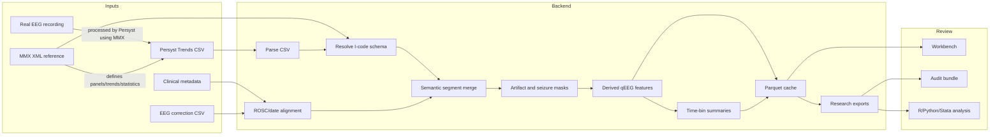
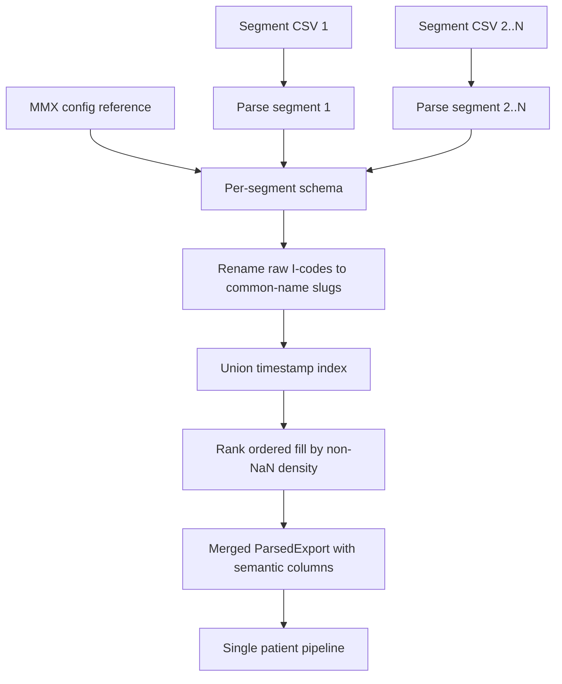
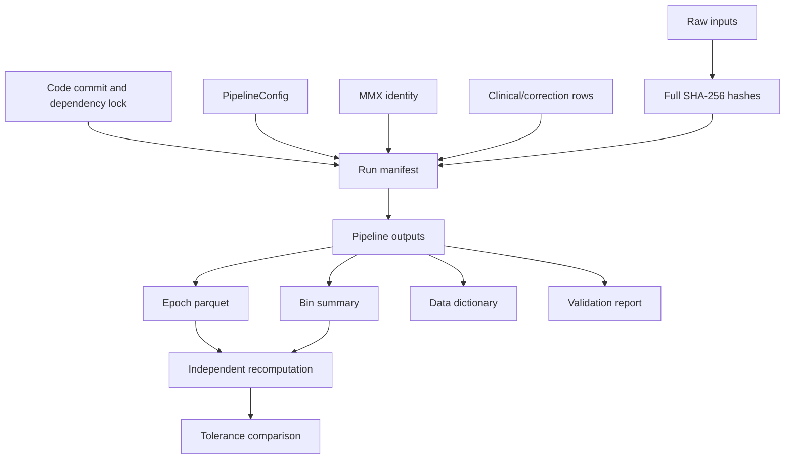

---
tags:
  - domain/eeg-monitoring
  - project/qeeg-pipeline
  - domain/research-methods
  - type/design
---

# Data Flow Figures

These figures are intended for review docs, protocols, and publication supplements. Keep them synchronized with `ARCHITECTURE.md` and `STATISTICAL_METHODS_AND_AUDIT.md`.

## System Workflow

## Multi-Segment Patient Flow

> Note: raw CSV I-codes are not portable across panel exports. The MMX-derived schema is the reference for trend identity and statistics whenever an MMX is available.

## Audit Trail

