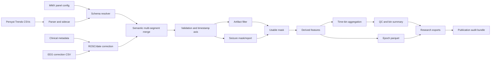
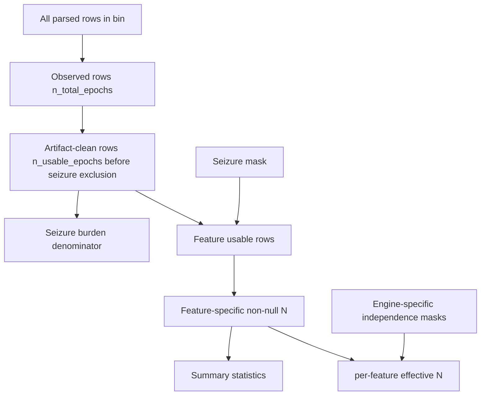
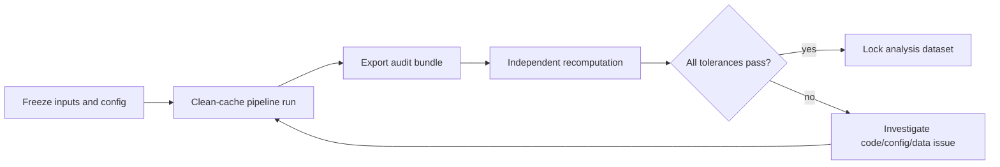

---
tags:
  - domain/eeg-monitoring
  - project/qeeg-pipeline
  - domain/research-methods
  - type/audit
---

# Statistical Methods And Audit Guide

Purpose: document what the pipeline calculates, how to review the calculations, and what must be fact-checked before publication. The code remains the source of truth; this document describes current behavior and known audit gaps as of 2026-04-24.

For the trend-by-trend engine/window/cadence/effective-N reference, see
[`TREND_ENGINE_REFERENCE.md`](TREND_ENGINE_REFERENCE.md).
For the data-dictionary statistical contract and maintenance checks, see
`docs/_archive/DATA_DICTIONARY_STATISTICAL_REVIEW.md`.

## Processing Stages

0. EEG is acquired and processed by Persyst using the study MMX file. The MMX defines the panels, trend calculations, instruments, channels, bands, and engine cadences used to create the exported trends.
1. Parse Persyst Trends CSV and convert `ClockDateTime`.
2. Resolve schema from MMX when available, otherwise regex mapping. For real study data, MMX resolution is the expected path because CSV I-codes are not stable across different panel exports.
3. Apply ROSC alignment or recording-start fallback.
4. Apply artifact filter and compute `_artifact_clean`.
5. Compute seizure mask from configured Persyst seizure mode.
6. Build `_usable = artifact_clean & ~seizure_mask` when seizure exclusion is enabled.
7. Compute regional and derived features.
8. Aggregate epoch rows into time bins.
9. Export bins, epochs, codebooks, and provenance.

## Current Calculation Rules

| Quantity | Current rule | Audit caveat |
|---|---|---|
| Time origin | ROSC if aligned, otherwise recording start. | Export provenance must state which was used. |
| Artifact-clean mask | Depends on `ArtifactConfig.mode`: `none`, `intensity`, `detector`, `quality`, or `combined`. | If selected columns are missing, rows may pass silently. |
| Seizure mask | `none`, detection > 0, or probability >= threshold. | Persyst-derived algorithmic trend, not clinical adjudication. |
| Feature usable mask | Artifact clean; optionally excludes seizure epochs. | Seizure exclusion mode must be recorded. |
| Bin labels | `pd.cut(hours_relative, edges, right=False)`. | Rows outside configured edges are not assigned to a bin. |
| Coverage hours | Timestamp-support estimate for artifact-clean rows. Large within-recording gaps are capped so gaps do not count as observed EEG. | Still assumes the timestamp axis accurately reflects exported trend support. |
| Proportion clean | `artifact_clean_hours / observed_wall_clock_hours` → exported as `clean_fraction_of_observed`. Of the EEG actually recorded in the bin, the fraction that was artifact-clean. | Equals 1.0 when all recorded EEG was clean, even if the recording covered only part of the bin. |
| Proportion of bin | `artifact_clean_hours / bin_expected_hours` → exported as `clean_fraction_of_expected`. Of the configured bin width, the fraction that was both recorded and artifact-clean. | Drives `missingness_flag`. Equals 0.5 when half the bin width was covered with clean EEG. |
| `coverage_fraction` | DEPRECATED alias of `clean_fraction_of_observed`. | Do not use in publications — its name is a reader trap. Use the two explicit fields above. |
| Minimum coverage | `coverage_hours >= min_coverage_hours`. | Uses artifact-clean timestamp support. |
| Missingness flag | Heuristic from `clean_fraction_of_expected`: complete, high_artifact, moderate_artifact, low_data, no_data. | Not MCAR/MAR/MNAR. |
| Summary stats | median, mean, SD, quantiles, IQR, min, max, N, 20 percent trimmed mean, CV. | CV is only valid when mean > 0. |
| Log power stats | Positive spectral-power values only; geometric mean and log SD. | Nonpositive values are omitted from log stats. **Log transform applies to FFT_Power (µV amplitude) and derived ratios; do NOT log-transform aEEG percentile columns (`aeeg_*_max/min/p50/p75/p25`) — these are bounded order statistics, not power.** |
| Derived ratios | theta/delta, alpha/delta, and log10 ratios. | Denominator zeros produce NaN or clipped log ratio behavior. |
| Effective N | Per-feature effective observation counts use the MMX engine cadence for features whose producing engine updates slower than the CSV row cadence. Legacy `n_effective_fft` is retained for FFT-derived features. FFTEngine01: epoch=4 s, step=8 s — each FFT value summarizes 4 s but new values emit every 8 s, so cadence-adjusted N is mandatory for FFT-family inference. | If MMX/engine metadata is absent, the export falls back to documented row-count or legacy FFT behavior. |
| aEEG percentile statistics | aEEG sub-cols `max / min / p50 / p75 / p25` are statistical percentiles of the smoothed envelope (per CSV Format Reference §3.4). | `max` and `min` are bounded order statistics with skewed distributions; clinical aEEG literature interprets these as the upper/lower envelope (extremes). `p50` is the robust central-tendency target; IQR = `p75 − p25` is the appropriate dispersion measure. **The SAP must pre-specify whether primary inference uses p50 (robust central) or max/min (extremes).** |
| Derived `fft_beta_wide_*` (13–30 Hz) | Pipeline-synthesized sum of FFT_Spectrogram bins 13–30 Hz. Inherits FFT cadence-adjusted N. | **NOT a Persyst-native FFT_Power band.** Must be flagged as `derived: true` in the data dictionary. The native FFT_Power bands are 1–4, 4–8, 8–13, 13–20 Hz only. |
| Units / scale | Canonical: see `PERSYST_V10_REFERENCE.md` §3a (Units canonical table). Notable corrections: BSR is **% (0–100)**, not fraction (0–1). FFT_Power is **µV** (amplitude — the template sets `PowerType=1`), not µV² and not µV²/Hz. FFT_Spectrogram is **µV/√Hz**. | Stats code that assumed FFT_Power was power or PSD must be checked. **ADR and RAV are therefore ratios of amplitudes:** a conventional power-based ratio equals the **square** of the exported value, so any comparison to published ADR figures must square first or say it did not. |
| Bin coverage fields | `bin_expected_hours`, `observed_wall_clock_hours`, `artifact_clean_hours`, `clean_fraction_of_observed`, `clean_fraction_of_expected`, `coverage_fraction`. | These are timestamp-support estimates, not row fractions. |
| Seizure burden | Percent seizure among artifact-clean epochs. | Persyst-derived algorithmic trend, not adjudicated electrographic seizure review. |
| Seizure event metrics | Raw event count/longest/time-to-first are exported separately from artifact-clean event count/longest/time-to-first. Status screening uses artifact-clean runs/burden. | Labels must stay explicit in publication tables. |
| Background continuity index | Proportion of usable epochs with non-missing suppression below threshold. | Returns NaN when suppression values are unavailable. |
| Slopes | Linear regression of bin midpoint versus metric median, broadcast to all rows. | Patient-level descriptor, not a mixed model. |

## Required Publication Provenance

Every analysis run should produce an audit bundle containing:

- Git commit, dirty-worktree flag, pipeline version, cache schema version.
- Python version and dependency lock/hash.
- Full SHA-256 for every raw CSV, MMX, clinical metadata file, EEG correction file, and generated export.
- Exact `PipelineConfig`.
- Study/MMX identity, full MMX file hash, and per-export MMX-derived column mapping used to interpret CSV I-codes.
- Per-patient source file order after correction sorting.
- Per-segment CSV stem, embedded `.dat` stem, correction row, clinical row, synthetic EEG start, ROSC timestamp, and final time reference.
- Stage row counts: parsed rows, leading-zero rows removed, pre-ROSC rows trimmed, artifact-clean rows, seizure rows, usable rows, binned rows.
- Per-feature engine/cadence metadata: trend family, Persyst engine, MMX `EpochDuration`, MMX `EpochStep`, `n_observed`, `n_effective`, and `n_effective_basis`.
- Cache hit/miss and whether the patient was recomputed from raw inputs.
- Codebook hash and data dictionary.
- Validation report with numeric tolerances.
- **Sub-col contract validator report** (`qeeg/ingestion/subcol_validator.py`, added 2026-05-21). Cohort lock is blocked if any patient's report contains an error-severity mismatch (FFT spectrogram with 39 bins instead of 40, aEEG with 4 sub-cols instead of 5, etc.). Warn-severity mismatches (Electrode Signal Quality count varying by acquisition system) are acceptable but must be recorded. Required because sub-col semantics are now keyed by family, not I-group, and the validator is the single line of defense against silent slug drift across MMX versions.
- **MMX provenance is single-valued.** The I-group → family mapping is template-specific, so each patient's MMX file hash must be in the audit bundle and the cohort must resolve to exactly one hash. Two hashes mean two column vocabularies and no safe cross-patient join. Where patients differ in which columns they carry, the cause to look for is the **export panel** (`Research-Trends` has no spectrograms; `Research-LimitedElectrodes` only single-chain derivations) — pre-specify that handling in the SAP.

Current implementation note: single-patient and batch research packages include the cached processing config, source hashes when files are accessible, auxiliary hashes when available, data dictionary, epoch parquet, provenance, and a package manifest. A complete publication audit bundle should still be verified for all generated export hashes, dirty-worktree state, dependency lock/hash, complete stage row-count checkpoints, and the sub-col validator report.

## Independent Fact-Check Workflow

1. Start from a clean cache or set an explicit `--force-recompute` mode.
2. Hash all inputs with full SHA-256.
3. Process a fixed patient set with a frozen config, MMX, clinical metadata, and corrections.
4. Export epoch parquet, bin summary, semi-long cohort data, data dictionary, and provenance bundle.
5. Independently recompute selected bin summaries from epoch parquet:
   - row counts;
   - exact usable row counts from `_usable` when present;
   - feature-specific non-null N;
   - medians, means, SDs, quantiles, IQR, min/max, trimmed mean, CV, and log stats;
   - coverage fields (`bin_expected_hours`, `observed_wall_clock_hours`, `artifact_clean_hours`, `clean_fraction_of_observed`, `clean_fraction_of_expected`, `coverage_fraction`);
   - seizure burden;
   - BCI;
   - slopes.
6. Compare recomputed values to exports with a tolerance file.
7. Repeat on a clean cache and compare export checksums.
8. Run negative controls:
   - change one correction time and confirm cache invalidation;
   - change MMX mapping and confirm schema/cache invalidation;
   - alter artifact mode and confirm affected denominators change.

## Current Audit Coverage

The independent fact-check script at [`scripts/audit_recompute.py`](../scripts/audit_recompute.py) currently checks:

- `n_total_epochs`
- exact `n_usable_epochs` when `_usable` is present in `epochs.parquet`
- `n_observed`
- `n_effective_fft` when `_is_independent_fft` is present
- per-feature `*_n_observed`, `*_n_effective`, and `*_effective_basis` when exported
- per-feature `n`
- per-feature median, mean, SD, p05, p10, p25, p75, p90, p95, IQR, min, max
- per-feature 20 percent trimmed mean
- per-feature coefficient of variation
- per-feature log mean and log SD for positive values
- `bin_expected_hours`
- `observed_wall_clock_hours`
- `artifact_clean_hours`
- `clean_fraction_of_observed`
- `clean_fraction_of_expected`
- `coverage_fraction`
- `coverage_hours`
- `meets_minimum`
- `missingness_flag`
- `background_continuity_index` when suppression source columns are available
- `seizure_burden_hours` and `seizure_burden_pct_bin` when the seizure flag is available
- slope fields exported from the bin summary

Remaining limitation:

- `n_effective_fft` is explicitly reported as **not checked** when `_is_independent_fft` is absent. The epoch parquet alone does not carry enough cadence metadata to reconstruct the same FFT independence rule with publication-grade confidence.
- Per-feature cadence-adjusted effective-N values are only independently auditable when the corresponding epoch-level independence marker or enough engine/cadence metadata is present in the audit artifacts. Otherwise the script reports them as **not checked** rather than treating row count as independent N.

Anything the script cannot safely reconstruct is reported as `not checked` rather than silently skipped.

## Synthetic Validation Fixtures To Add

| Fixture | Expected check |
|---|---|
| EEG starts halfway through first ROSC bin | Expected wall-clock coverage is partial, not complete. |
| Within-bin timestamp gap | Gap survives correction and appears in overlay/QC. |
| Non-1s timestamps | Coverage hours and seizure burden use actual time support. |
| No artifact columns for selected mode | Export flags unavailable artifact source. |
| All-artifact bin | Bin retained with no feature summaries and appropriate coverage flag. |
| Seizure overlaps artifact | Raw and artifact-clean seizure summaries differ with explicit labels. |
| Corrected multi-segment + MMX | Semantic merge uses MMX, not regex fallback. |
| CSV stem differs from embedded `.dat` stem | Dat-stem correction affects cache key and reprocessing. |
| `subject-1` and `subject-10` cache dirs | Clearing one patient does not remove the other. |
| Signed asymmetry spectrogram downsampling | Dominant negative values remain negative. |
| Cohort spanning more than one export panel | `subcol_validator` passes for every patient; family-keyed slugs resolve identically across panels; columns absent from a narrower panel are flagged as panel-keyed MNAR, not silently null. |
| Rhythmicity spectrogram bin axis | Bin 49 reports center frequency `9_00hz` (sqrt-scaled formula `f_k = (1 + (k-1)/24)²`), NOT `13.0hz` (legacy linear approximation). |
| aEEG percentile ordering invariant | For every row, `aeeg_{side}_min ≤ p25 ≤ p50 ≤ p75 ≤ max` and `IQR = p75 − p25 ≥ 0`. Sub-col validator + audit script enforce this. |
| `subcol_validator` regression on a known-good export | Zero error-severity mismatches; archived report SHA-256 in audit bundle. |

## Figures

### End-To-End Data Flow

### Denominator Flow

### Publication Fact-Check Loop

